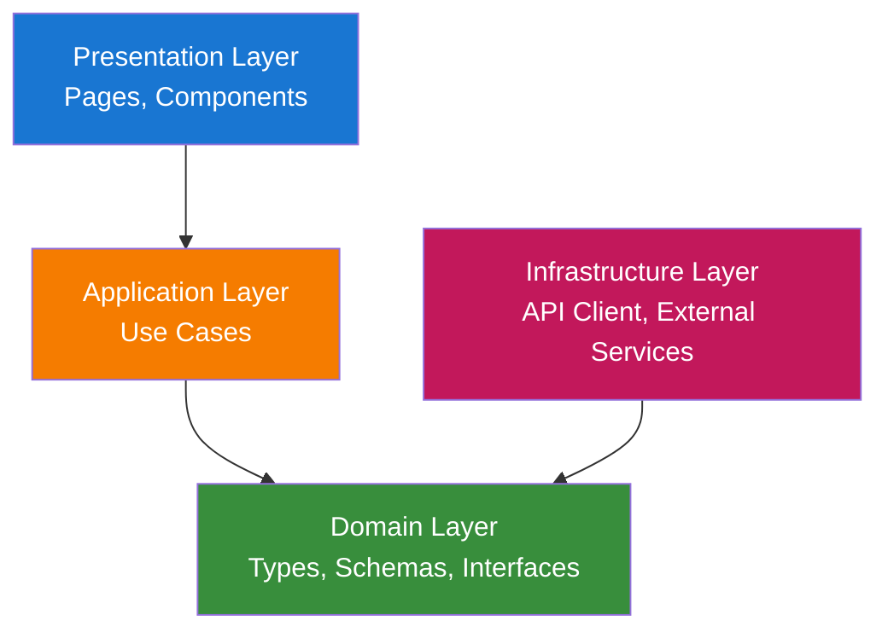
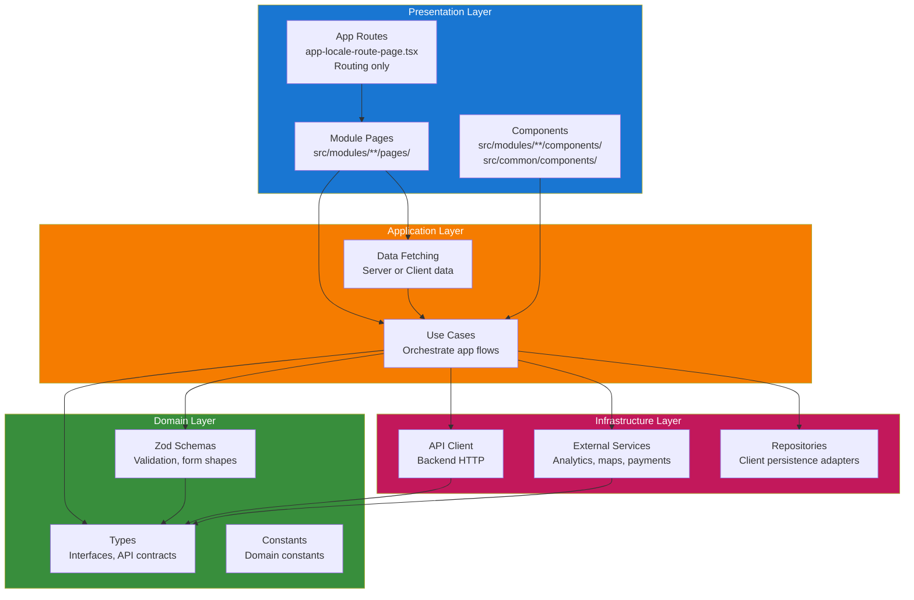
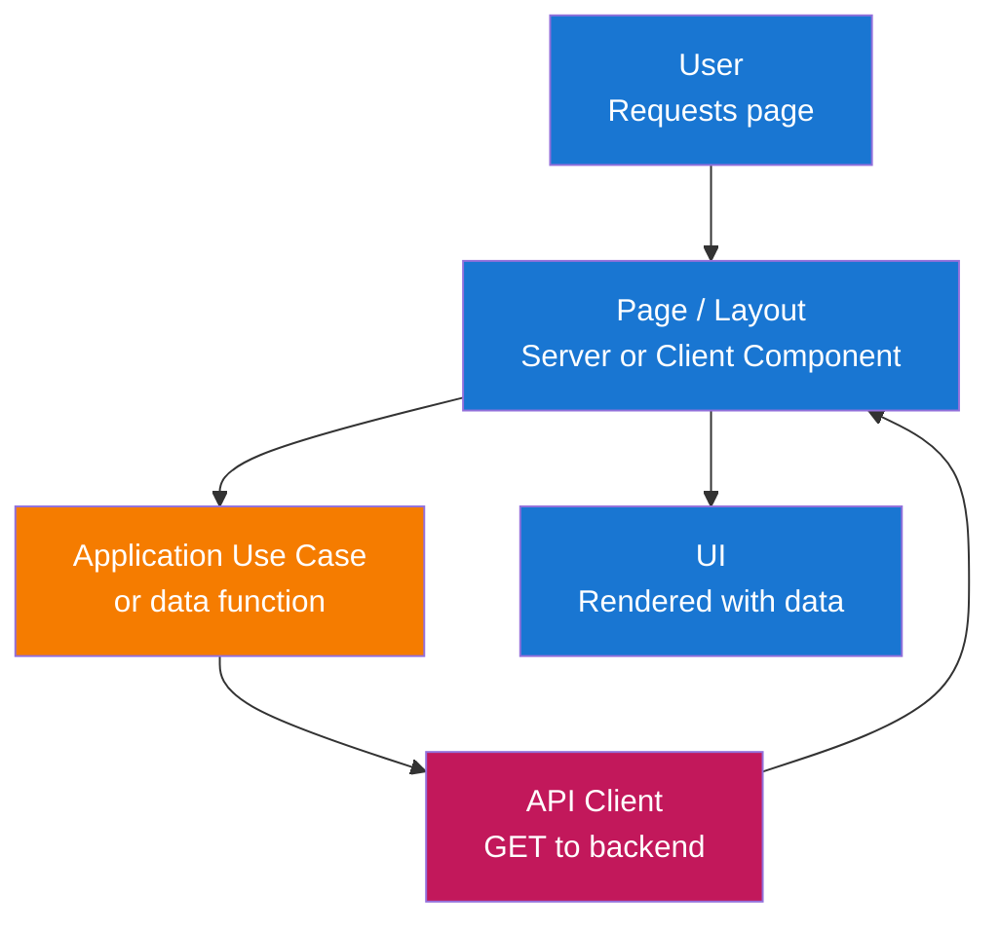
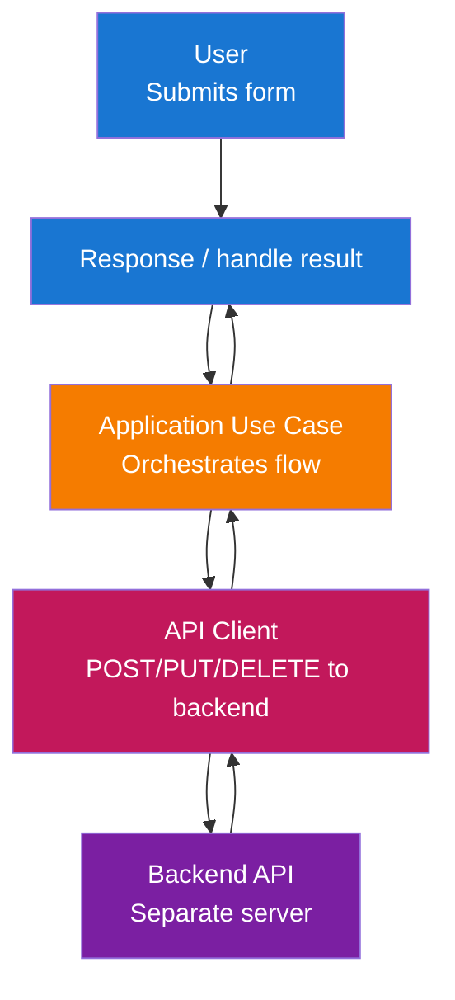

# Kiến trúc

Frontend này tuân theo **Clean Architecture** với cấu trúc **module**. Ứng dụng dễ bảo trì, dễ testing và phù hợp với Next.js cùng UI stack đã chọn.

## Tổng quan kiến trúc

Giải pháp được tổ chức theo các layer đảm bảo tách biệt trách nhiệm và đảo ngược phụ thuộc:



**Mô tả các layer:**

- **Presentation Layer**: Điểm vào tương tác người dùng—trang Next.js, layout và component React. Layer này render UI và xử lý đầu vào, ủy thác logic nghiệp vụ và dữ liệu cho application layer.

- **Application Layer**: Điều phối use case và logic ứng dụng—lấy dữ liệu, xử lý gửi form, validation và phối hợp quy tắc domain với infrastructure. Không có UI hay chi tiết framework ở đây.

- **Domain Layer**: Types cốt lõi, Zod schemas và interfaces dùng trong toàn app. Không phụ thuộc bên ngoài; định nghĩa hình dạng dữ liệu và quy tắc validation (vd. API contracts, form payloads).

- **Infrastructure Layer**: Triển khai kỹ thuật—API client (HTTP tới backend) và dịch vụ bên ngoài. Thực hiện interface do application hoặc domain layer định nghĩa.

## Cấu trúc layer

Cấu trúc layer đầy đủ với tất cả thành phần:



## Luồng dữ liệu

### Luồng đọc (Server hoặc Client Page)



### Luồng ghi (Form Submission)



## Trách nhiệm từng layer

### 1. Domain Layer (`src/modules/{module}/domain/` hoặc `src/common/domain/`)

Types và validation cốt lõi, không phụ thuộc bên ngoài.

**Thành phần:**

- **Types**: Interfaces và type aliases cho API response, form state và khái niệm toàn app (vd. `User`, `Session`, `ApiError`).
- **Zod Schemas**: Validation và parse cho form; trong `src/common/domain/schemas/` hoặc `domain/schemas.ts` mỗi module.
- **Constants**: Hằng số liên quan domain (vd. route paths, error codes) dùng trong toàn app.

**Nguyên tắc:**

- Không phụ thuộc layer khác hay framework.
- Chỉ types và schemas; không I/O, không React, không Next.

### 2. Application Layer (`src/modules/{module}/application/` hoặc `src/common/application/`)

Điều phối use case và logic ứng dụng.

**Thành phần:**

- **Use Cases**: Hàm hoặc class thực hiện luồng ứng dụng (vd. `loginUser()`, `fetchUserProfile()`). Dùng domain types/schemas và infrastructure (API client).
- **Stores**: State container cấp module (vd. Zustand slices) phối hợp UI state với use case.
- **Data-fetching helpers**: Hàm dùng bởi Server Components hoặc Client Components để tải dữ liệu qua use case/API client.

**Nguyên tắc:**

- Chỉ phụ thuộc Domain và Infrastructure (qua interface khi phù hợp).
- Không UI, không React hooks, không API Next trong logic cốt lõi; chỉ điều phối.

### 3. Infrastructure Layer (`src/modules/{module}/infrastructure/` hoặc `src/common/infrastructure/`)

Triển khai các vấn đề kỹ thuật và tích hợp bên ngoài.

**Thành phần:**

- **API Client**: HTTP client tới backend (fetch hoặc wrapper). Thực hiện contract mà application layer mong đợi.
- **Services**: Tích hợp bên ngoài (analytics, maps, payments, v.v.).
- **Repositories**: Adapter lưu trữ phía client (localStorage, IndexedDB, cookies).
- **External SDKs**: Thư viện bên thứ ba dùng bởi services hoặc repositories.

**Nguyên tắc:**

- Thực hiện interface/contract dùng bởi application layer.
- Mọi I/O bên ngoài và chi tiết framework nằm ở đây.

### 4. Presentation Layer (pages, components)

Xử lý tương tác người dùng và render UI.

**Thành phần:**

- **App Routes**: `app/[locale]/**/page.tsx` chỉ là routing layer. Các file này import và render page component từ `src/modules/{module}/pages/`.
- **Module Pages**: `src/modules/{module}/pages/` chứa page component thực tế. Page có thể là Server hoặc Client Component tùy nhu cầu dữ liệu và hooks.
- **Components**: Component theo module trong `src/modules/{module}/components/`; component dùng chung trong `src/common/components/` (gồm `ui/` cho shadcn). Component có thể Server hoặc Client; dùng `"use client"` chỉ khi cần.

**Nguyên tắc:**

- Phụ thuộc Application (và Domain chỉ qua types/schemas).
- Gắn với framework: Next.js App Router, React. Giữ logic nghiệp vụ ở application layer.
- `/app` chỉ cho routing; toàn bộ code nằm trong `/src`.

## Cấu trúc module

App dùng `/src` làm thư mục nguồn chính, giữ `/app` chỉ cho routing. Code tổ chức theo **module** (theo tính năng) trong `/src`, với code dùng chung trong `/src/common`.

### Tổng quan cấu trúc dự án

```text
app/                               # Chỉ routing layer (Next.js App Router)
└── [locale]/                      # Segment locale (next-intl)
    ├── layout.tsx                 # Import RootLayout từ src/common
    ├── page.tsx                   # Import LandingPage từ src/modules/landing-page
    ├── auth/
    │   ├── sign-in/
    │   │   └── page.tsx           # Import SignInPage từ src/modules/auth
    │   ├── sign-up/
    │   │   └── page.tsx           # Import SignUpPage từ src/modules/auth
    │   └── forgot-password/
    │       └── page.tsx           # Import ForgotPasswordPage từ src/modules/auth

src/                               # Toàn bộ code ứng dụng ở đây
├── application/                   # Thiết lập cấp app (next-intl)
│   ├── localization/              # Bản dịch next-intl
│   │   ├── en.json
│   │   └── {locale}.json
│   └── configurations/            # Cấu hình cấp app
├── common/                        # Code dùng chung mọi module
│   ├── routing/                   # Cấu hình routing next-intl
│   │   ├── routing.ts             # Cấu hình locale routing
│   │   ├── navigation.ts          # Link, useRouter, usePathname
│   │   └── request.ts             # Cấu hình request cho getTranslations
│   ├── components/                # Component dùng chung
│   │   ├── ui/                    # Component shadcn/ui
│   │   ├── layout/                # Component layout (Header, Footer, Sidebar)
│   │   └── ...                    # Component dùng chung khác
│   ├── domain/                    # Domain layer dùng chung
│   │   ├── types.ts               # Types dùng chung (User, Session, ApiError)
│   │   └── schemas.ts             # Zod schemas dùng chung
│   ├── application/               # Application layer dùng chung
│   │   └── services/              # Services dùng chung (nếu có)
│   ├── infrastructure/            # Infrastructure dùng chung
│   │   ├── api-client.ts          # HTTP client tới backend
│   │   ├── services/              # Dịch vụ bên ngoài (analytics, maps, v.v.)
│   │   └── repositories/          # Lưu trữ client (localStorage, IndexedDB)
│   ├── stores/                    # Zustand stores (chỉ client)
│   ├── hooks/                     # React hooks dùng chung
│   ├── utils/                     # Tiện ích (cn(), formatters, v.v.)
│   └── config/                    # Cấu hình app
│
├── modules/                       # Module tính năng
│   ├── auth/                      # Module auth
│   │   ├── domain/
│   │   │   ├── types.ts           # Types riêng auth
│   │   │   └── schemas.ts         # Zod schemas auth (login, register)
│   │   ├── application/
│   │   │   ├── use-cases/         # Use case auth
│   │   │   └── stores/            # State stores module
│   │   ├── infrastructure/       # Infra riêng (cùng cấu trúc common)
│   │   │   ├── api-client.ts      # Method API client module (tùy chọn)
│   │   │   ├── services/         # Dịch vụ bên ngoài module
│   │   │   └── repositories/     # Lưu trữ client module
│   │   ├── pages/                 # Trang (mỗi trang một thư mục)
│   │   │   ├── sign-in/
│   │   │   │   ├── page.tsx        # Component trang đăng nhập
│   │   │   │   └── components/     # Component con trang đăng nhập
│   │   │   ├── sign-up/
│   │   │   │   ├── page.tsx        # Component trang đăng ký
│   │   │   │   └── components/     # Component con trang đăng ký
│   │   │   └── forgot-password/
│   │   │       ├── page.tsx        # Component trang quên mật khẩu
│   │   │       └── components/     # Component con trang quên mật khẩu
│   │   └── components/            # Component dùng chung trong module
│   │
│   └── {module-name}/             # Module khác cùng cấu trúc
│       ├── domain/
│       ├── application/
│       ├── infrastructure/
│       ├── pages/
│       └── components/
```

### App Routes (chỉ routing layer)

Thư mục `/app` chỉ chứa file routing Next.js, import từ `/src`:

```tsx
// app/[locale]/auth/sign-in/page.tsx
import { SignInPage } from "@/modules/auth/pages/sign-in/page";

export default function Page() {
  return <SignInPage />;
}
```

```tsx
// app/[locale]/layout.tsx
import { RootLayout } from "@/common/components/root-layout";

export default function Layout({ children }: { children: React.ReactNode }) {
  return <RootLayout>{children}</RootLayout>;
}
```

Cách này giữ `/app` tối thiểu và toàn bộ code trong `/src` để dễ tổ chức và kiểm thử.

## Các mẫu thiết kế quan trọng

### 1. Clean Architecture / Layered Architecture

**Mục đích**: Tách biệt trách nhiệm và đảo ngược phụ thuộc (layer trong không phụ thuộc layer ngoài).

**Triển khai:**

- **Domain**: Types, Zod schemas, constants—không framework, không I/O.
- **Application**: Use case; chỉ phụ thuộc Domain và interface Infrastructure.
- **Infrastructure**: API client và tích hợp bên ngoài; thực hiện những gì Application cần.
- **Presentation**: Pages và components; phụ thuộc Application (và types Domain).

**Lợi ích:**

- Dễ kiểm thử: Logic application và domain có thể test không cần UI hay HTTP thật.
- Dễ bảo trì: Thay đổi trong một layer được giới hạn.
- Linh hoạt: Đổi API client hoặc cách auth mà không đổi use case.

### 2. Cấu trúc tính năng theo module

**Mục đích**: Gom tính năng (auth, dashboard, settings) và ranh giới rõ ràng.

**Triển khai:**

- Toàn bộ code trong `/src`; `/app` chỉ cho routing.
- Gom theo tính năng trong `src/modules/{feature}/` với `pages/`, `components/`, `domain/`, `application/`.
- Code dùng chung (API client, auth, UI, stores) trong `src/common/`.

**Lợi ích:**

- Quyền sở hữu và khả năng tìm kiếm rõ.
- Cùng mô hình với backend module mà không phức tạp DDD.
- Dễ test hơn khi code tách khỏi routing.

### 3. Trừu tượng API Client (Infrastructure)

**Mục đích**: Tập trung giao tiếp backend và giữ application layer độc lập với chi tiết HTTP.

**Triển khai:**

- API client trong `src/common/infrastructure/api-client.ts` expose method như `getUser()`, `login(credentials)`.
- Dùng domain types cho request/response khi có thể.
- Application services gọi API client, không gọi `fetch` trực tiếp.

**Lợi ích:**

- Dễ mock trong test và đổi URL backend hoặc transport sau này.

### 4. Zod cho Validation và Types

**Mục đích**: Một nguồn sự thật cho validation và inferred types.

**Triển khai:**

- Zod schemas trong `src/common/domain/schemas/` (dùng chung) hoặc `src/modules/{module}/domain/schemas.ts` mỗi module.
- Dùng với React Hook Form qua `zodResolver(schema)`.
- Export types với `z.infer<typeof schema>`.

**Lợi ích:**

- Validation nhất quán trên client; type safety từ schemas.

### 5. Dependency Injection / Interfaces (tùy chọn)

**Mục đích**: Ghép lỏng và dễ test khi cần.

**Triển khai:**

- Application services nhận API client hoặc client dịch vụ bên ngoài qua constructor hoặc tham số hàm.
- Trong test, truyền mock; trong app, truyền implementation thật từ `src/common/infrastructure/`.

**Lợi ích:**

- Unit test dễ hơn và có thể đổi implementation (vd. mock API cho storybook hoặc test).

## Technology Stack

- **Framework**: Next.js (App Router), React
- **Language**: TypeScript (strict mode)
- **UI**: shadcn/ui (Radix UI + Tailwind CSS)
- **State**: Zustand (client-only global state)
- **Forms**: React Hook Form với Zod (`@hookform/resolvers/zod`)
- **Validation**: Zod (form validation)
- **i18n**: next-intl (locale-based routing, messages, `getTranslations` / `useTranslations`)
- **DI**: Awilix (dependency injection)
- **Testing**: Vitest (và React Testing Library khi phù hợp)

## Next.js và quy ước

### App Router (chỉ routing)

- **Routes**: `app/[locale]/{segment}/page.tsx` cho routing; các file này import page component từ `src/modules/{module}/pages/`.
- **Không code trong /app**: Toàn bộ logic nghiệp vụ, components và services trong `/src`. Thư mục `/app` chỉ xử lý routing Next.js.
- **Server vs Client**: Pages và components có thể là Server hoặc Client Components. Mặc định Server Components; thêm `"use client"` chỉ cho hooks, browser APIs hoặc Zustand.
- **Client boundary**: Giữ `"use client"` càng thấp càng tốt (leaf component hoặc wrapper nhỏ).

### Data Fetching và Mutations

- **Server Components**: Lấy dữ liệu qua application layer (use case trong `src/modules/{module}/application/use-cases/`); không `fetch` trực tiếp trong component khi đó là use case.
- **Client Components**: Với mutations (form), gọi application services dùng API client để giao tiếp với backend API riêng. Client Components cũng có thể lấy dữ liệu qua use case khi cần.
- **Forms**: Validate với Zod (React Hook Form), rồi gọi application services để gửi dữ liệu lên backend.

### Quy ước file và thư mục

- **Mọi file và thư mục dùng kebab-case** (chữ thường, nối bằng dấu gạch ngang), trừ file route dành riêng Next.js như `page.tsx`, `layout.tsx`.
- **Component có props phải định nghĩa props type** và dùng trong chữ ký component.
- **Component không có props** không định nghĩa props type và không có tham số props.
- `app/` – chỉ routing (page.tsx, layout.tsx, loading, error, not-found); dưới `app/[locale]/` với next-intl. Import từ `/src`.
- `src/application/` – thiết lập next-intl (localization, routing).
- `src/common/components/` – component dùng chung; `src/common/components/ui/` cho shadcn.
- `src/common/infrastructure/` – API client, services, repositories.
- `src/common/domain/` – types và schemas dùng chung (dạng file).
- `src/common/stores/` – Zustand stores (chỉ client).
- `src/common/utils/` – tiện ích (`cn()`, formatters, v.v.).
- `src/modules/{module}/` – module tính năng với pages, components, domain, application.
- `src/application/localization/` – file JSON bản dịch next-intl theo locale.
- `src/common/routing/` – cấu hình routing, navigation và request next-intl.

### Forms và Validation

- Dùng React Hook Form với Zod (`zodResolver(schema)`) và Form components shadcn từ `src/common/components/ui/`.
- Khi submit form, gọi application services dùng API client gửi dữ liệu lên backend.
- Xử lý lỗi API và map vào form state khi cần.

### Quốc tế hóa (next-intl)

- Routing theo locale: `app/[locale]/...`; middleware phát hiện locale.
- Server: `getTranslations('namespace')`; client: `useTranslations('namespace')`.
- Dùng next-intl `Link` và `useRouter` cho điều hướng theo locale.
