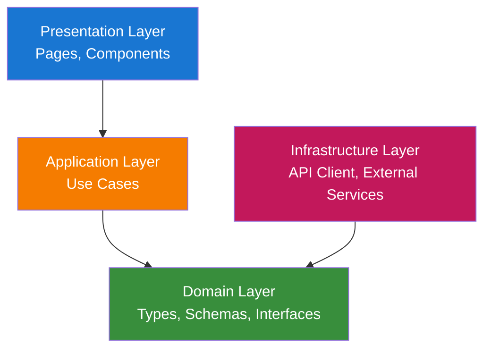
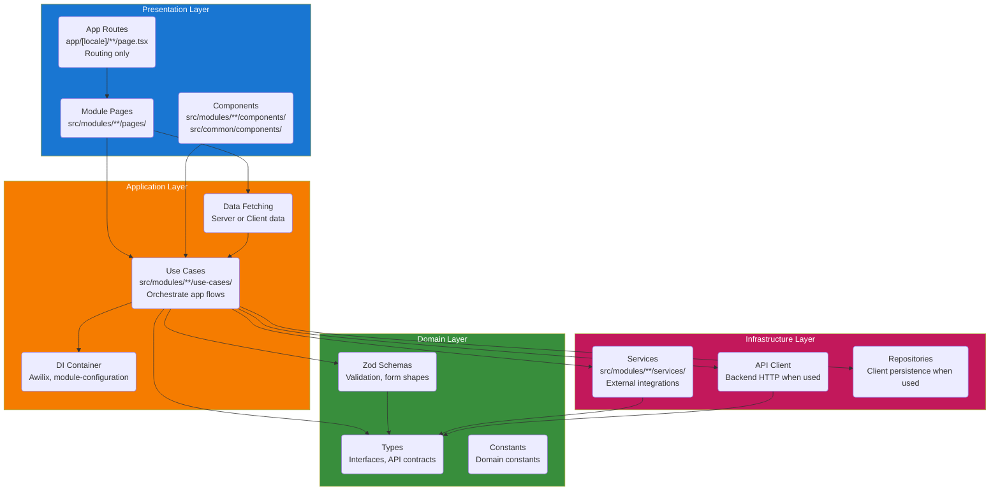
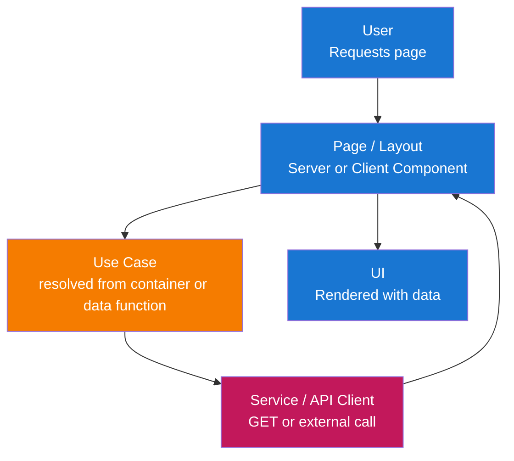
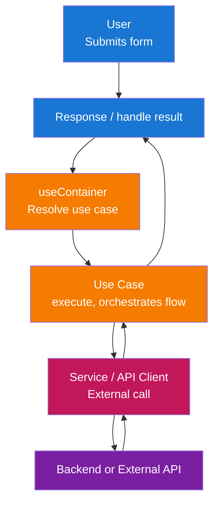

# Kiến trúc

Frontend này tuân theo **Clean Architecture** với cấu trúc **module**. Ứng dụng dễ bảo trì, dễ testing và phù hợp với Next.js cùng UI stack đã chọn.

## Tổng quan kiến trúc

Giải pháp được tổ chức theo các layer đảm bảo tách biệt trách nhiệm và đảo ngược phụ thuộc:



**Mô tả các layer:**

- **Presentation Layer**: Điểm vào tương tác người dùng—trang Next.js, layout và component React. Layer này render UI và xử lý đầu vào, ủy thác logic nghiệp vụ và dữ liệu cho application layer.

- **Application Layer**: Điều phối use case và logic ứng dụng—lấy dữ liệu, xử lý gửi form, validation và phối hợp quy tắc domain với infrastructure. Không có UI hay chi tiết framework ở đây.

- **Domain Layer**: Types cốt lõi, Zod schemas và interfaces dùng trong toàn app. Không phụ thuộc bên ngoài; định nghĩa hình dạng dữ liệu và quy tắc validation (vd. API contracts, form payloads).

- **Infrastructure Layer**: Triển khai kỹ thuật—API client (HTTP tới backend) và dịch vụ bên ngoài. Thực hiện interface do application hoặc domain layer định nghĩa.

## Cấu trúc layer

Cấu trúc layer đầy đủ với tất cả thành phần:



## Luồng dữ liệu

### Luồng đọc (Server hoặc Client Page)



### Luồng ghi (Form Submission)



## Trách nhiệm từng layer

### 1. Domain Layer (`src/modules/{module}/domain/`)

Types và validation cốt lõi, không phụ thuộc bên ngoài. Khái niệm domain dùng chung có thể nằm trong domain của module hoặc common interfaces.

**Thành phần:**

- **Types**: Interfaces và type aliases cho API response, form state và khái niệm module (vd. auth types trong `src/modules/auth/domain/types.ts`).
- **Zod Schemas**: Validation và parse cho form trong `domain/schemas.ts` mỗi module.
- **Constants**: Hằng số liên quan domain (vd. route paths, error codes) dùng trong module.

**Nguyên tắc:**

- Không phụ thuộc layer khác hay framework.
- Chỉ types và schemas; không I/O, không React, không Next.

### 2. Application Layer (`src/modules/{module}/use-cases/` + DI)

Điều phối use case và logic ứng dụng. Use case được resolve từ Awilix container; module đăng ký qua `module-configuration.ts`.

**Thành phần:**

- **Use Cases**: Class (hoặc hàm) trong `src/modules/{module}/use-cases/` thực hiện luồng ứng dụng (vd. `SignInWithEmailUseCase`, `UpdateProfileUseCase`). Kế thừa `BaseUseCase` từ `src/common/utils/base-use-case.ts`, dùng domain types/schemas và phụ thuộc services hoặc API client qua container.
- **Module state**: State cấp module (vd. Zustand) expose qua hooks trong `src/modules/{module}/hooks/` (vd. `use-auth-user-store.ts`).
- **Data-fetching**: Server hoặc Client Components tải dữ liệu bằng cách resolve và gọi use case từ container.

**Nguyên tắc:**

- Chỉ phụ thuộc Domain và Infrastructure (inject qua Awilix).
- Không UI, không React trong class use case; chỉ điều phối.

### 3. Infrastructure Layer (`src/modules/{module}/services/`)

Triển khai vấn đề kỹ thuật và tích hợp bên ngoài. API client hoặc repositories theo module khi cần.

**Thành phần:**

- **Services**: Tích hợp bên ngoài trong `src/modules/{module}/services/` (vd. `FirebaseAuthenticationService` trong auth). Thực hiện interface định nghĩa trong `src/modules/{module}/interfaces/`.
- **API Client**: Khi app gọi backend HTTP API, client có thể nằm trong `src/common/` hoặc theo module và được đăng ký trong container.
- **Repositories**: Adapter lưu trữ phía client (localStorage, IndexedDB, cookies) khi cần.

**Nguyên tắc:**

- Thực hiện interface dùng bởi use case (inject qua container).
- Mọi I/O bên ngoài và dùng SDK nằm ở đây.

### 4. Presentation Layer (pages, components)

Xử lý tương tác người dùng và render UI.

**Thành phần:**

- **App Routes**: `app/[locale]/**/page.tsx` (và route group như `(marketing)`) chỉ là routing layer. Chúng import và render page component từ `src/modules/{module}/pages/`.
- **Module Pages**: `src/modules/{module}/pages/{page}/page.tsx` chứa page component thực tế. Page có thể là Server hoặc Client Component; component riêng trang nằm trong `pages/{page}/components/`.
- **Components**: Component dùng chung module trong `src/modules/{module}/components/`; component dùng chung trong `src/common/components/` (vd. form, input, label, root-layout, main-layout). Dùng `"use client"` chỉ khi cần (hooks, browser APIs, Zustand).

**Nguyên tắc:**

- Phụ thuộc Application (use case qua container) và Domain (chỉ types).
- Gắn với framework: Next.js App Router, React. Logic nghiệp vụ nằm trong use case và services.
- `/app` chỉ cho routing; toàn bộ code ứng dụng nằm trong `/src`.

## Cấu trúc module

App dùng `/src` làm thư mục nguồn chính, giữ `/app` chỉ cho routing. Code tổ chức theo **module** (theo tính năng) trong `/src`, với code dùng chung trong `/src/common`.

### Tổng quan cấu trúc dự án

```text
app/                               # Chỉ routing layer (Next.js App Router)
├── [locale]/                      # Segment locale (next-intl)
│   ├── layout.tsx                 # Root layout: AppInitializer, SyncAuthState, RootLayout, Toaster
│   ├── error.tsx                  # Error boundary
│   ├── not-found.tsx              # Not-found handler
│   ├── (marketing)/               # Route group: trang marketing
│   │   ├── layout.tsx             # MainLayout với menu, AuthHeaderSlot
│   │   ├── page.tsx               # Trang landing (LandingPage từ module landing-page)
│   │   ├── docs/
│   │   │   └── [slug]/
│   │   │       └── page.tsx       # Trang doc từ module docs
│   │   ├── privacy-policy/
│   │   │   └── page.tsx           # Module legal
│   │   └── terms-of-service/
│   │       └── page.tsx           # Module legal
│   ├── app/
│   │   └── page.tsx               # Trang app từ module main
│   └── auth/
│       ├── layout.tsx             # AuthLayout từ module auth
│       ├── sign-in/
│       │   └── page.tsx           # SignInPage từ module auth
│       ├── sign-up/
│       │   └── page.tsx           # SignUpPage từ module auth
│       ├── forgot-password/
│       │   └── page.tsx           # ForgotPasswordPage từ module auth
│       └── profile/
│           └── page.tsx           # Trang profile từ module auth
├── globals.css                    # Global styles
├── layout.tsx                     # Root app layout
└── not-found.tsx                  # Root not-found fallback

src/                               # Toàn bộ code ứng dụng ở đây
├── __tests__/                     # Test mirror src (application/, common/, modules/) + test-utils/
├── application/                   # Thiết lập cấp app
│   ├── components/                # Component cấp app (vd. AppInitializer)
│   ├── config/                    # Cấu hình app (firebase-config, main-menu)
│   ├── i18n/                      # Helper request next-intl (getRequestConfig)
│   ├── localization/              # JSON bản dịch next-intl (en, vi, zh)
│   └── register-container.ts      # Đăng ký container Awilix, đăng ký module
├── common/                        # Code dùng chung mọi module
│   ├── components/                # Component dùng chung (flat)
│   │   ├── button.tsx             # Button, Card, Dialog, Form, Input, Label
│   │   ├── root-layout.tsx        # RootLayout
│   │   ├── main-layout.tsx        # MainLayout, MainHeader
│   │   ├── toaster.tsx            # Toaster (Sonner)
│   │   └── ...                    # app-initializer, back-to-home-button, icons, v.v.
│   ├── hooks/                     # Hooks dùng chung (vd. use-container)
│   ├── interfaces/                # Interface dùng chung (vd. menu-item)
│   ├── pages/                     # Component trang dùng chung (error-page, not-found-page)
│   ├── routing/                   # Routing next-intl
│   │   ├── routing.ts             # Locales, cấu hình routing
│   │   ├── navigation.ts          # Link, useRouter, usePathname
│   │   └── request.ts             # getRequestConfig messages (dùng application/localization)
│   └── utils/                     # Tiện ích (cn, container, base-use-case, menu, read-doc)
│
├── modules/                       # Module tính năng
│   ├── auth/                      # Module auth (Firebase, sign-in, sign-up, profile)
│   │   ├── domain/
│   │   │   ├── types.ts           # Types auth
│   │   │   └── schemas.ts         # Zod schemas auth (login, register, profile)
│   │   ├── use-cases/             # Use case auth (sign-in, sign-up, sign-out, v.v.)
│   │   ├── services/              # Firebase auth service (implement interface auth)
│   │   ├── interfaces/           # Interface BaseAuthenticationService
│   │   ├── hooks/                 # use-auth-user-store, use-sync-auth-state
│   │   ├── components/            # AuthLayout, AuthVerification, SyncAuthState, AuthHeaderSlot
│   │   ├── pages/                 # Trang (mỗi trang một thư mục)
│   │   │   ├── sign-in/
│   │   │   │   ├── page.tsx       # Trang đăng nhập
│   │   │   │   └── components/   # sign-in-form
│   │   │   ├── sign-up/
│   │   │   │   ├── page.tsx       # Trang đăng ký
│   │   │   │   └── components/   # sign-up-form
│   │   │   ├── forgot-password/
│   │   │   │   ├── page.tsx       # Trang quên mật khẩu
│   │   │   │   └── components/   # forgot-password-form
│   │   │   └── profile/
│   │   │       ├── page.tsx       # Trang profile
│   │   │       └── components/   # profile-form
│   │   ├── utils/                 # map-auth-error, v.v.
│   │   └── module-configuration.ts # Awilix: đăng ký auth services và use cases
│   │
│   ├── docs/                      # Module docs (markdown theo slug)
│   │   ├── components/            # MarkdownContent, MermaidDiagram
│   │   ├── pages/doc/page.tsx     # Component trang doc
│   │   └── module-configuration.ts
│   ├── landing-page/              # Module trang landing
│   │   ├── pages/home/            # Trang chủ + component scroll-reveal
│   │   └── module-configuration.ts
│   ├── legal/                     # Trang pháp lý (privacy, terms)
│   │   ├── pages/privacy-policy/  # và terms-of-service
│   │   └── module-configuration.ts
│   ├── main/                      # Trang app chính (sau đăng nhập)
│   │   ├── pages/app/page.tsx
│   │   └── module-configuration.ts
│   │
│   └── {module-name}/             # Module mới cùng cấu trúc
│       ├── domain/                # types.ts, schemas.ts (khi cần)
│       ├── use-cases/             # Class use case, resolve qua container
│       ├── services/             # Dịch vụ bên ngoài (khi cần)
│       ├── interfaces/            # Interface service/port (khi cần)
│       ├── hooks/                 # Hooks state module (khi cần)
│       ├── components/            # Component dùng chung module
│       ├── pages/                 # pages/{page}/page.tsx + components/
│       ├── utils/                 # Tiện ích module (khi cần)
│       └── module-configuration.ts # registerModule(container)
```

### App Routes (chỉ routing layer)

Thư mục `/app` chỉ chứa file routing Next.js, import từ `/src`:

```tsx
// app/[locale]/auth/sign-in/page.tsx
import { SignInPage } from "@/modules/auth/pages/sign-in/page";

export default function Page() {
  return <SignInPage />;
}
```

```tsx
// app/[locale]/layout.tsx
import { AppInitializer } from "@/application/components/app-initializer";
import { RootLayout } from "@/common/components/root-layout";
import { Toaster } from "@/common/components/toaster";
import { SyncAuthState } from "@/modules/auth/components/sync-auth-state";

export default async function LocaleLayout({ children, params }: { ... }) {
  // ... thiết lập next-intl
  return (
    <NextIntlClientProvider locale={locale} messages={messages}>
      <AppInitializer />
      <SyncAuthState />
      <RootLayout>{children}</RootLayout>
      <Toaster />
    </NextIntlClientProvider>
  );
}
```

Route group (vd. `(marketing)`) dùng layout chung cung cấp MainLayout với menu và auth slot; route auth dùng AuthLayout. Cách này giữ `/app` tối thiểu và toàn bộ code trong `/src` để dễ tổ chức và kiểm thử.

## Các mẫu thiết kế quan trọng

### 1. Clean Architecture / Layered Architecture

**Mục đích**: Tách biệt trách nhiệm và đảo ngược phụ thuộc (layer trong không phụ thuộc layer ngoài).

**Triển khai:**

- **Domain**: Types, Zod schemas, constants—không framework, không I/O.
- **Application**: Use case (trong `use-cases/`); chỉ phụ thuộc Domain và interface Infrastructure, resolve qua Awilix.
- **Infrastructure**: Services (trong `services/`) và API client tùy chọn; thực hiện interface dùng bởi use case.
- **Presentation**: Pages và components; phụ thuộc Application (và types Domain).

**Lợi ích:**

- Dễ kiểm thử: Logic application và domain có thể test không cần UI hay HTTP thật.
- Dễ bảo trì: Thay đổi trong một layer được giới hạn.
- Linh hoạt: Đổi API client hoặc cách auth mà không đổi use case.

### 2. Cấu trúc tính năng theo module

**Mục đích**: Gom tính năng (auth, docs, landing, legal, main) và ranh giới rõ ràng.

**Triển khai:**

- Toàn bộ code trong `/src`; `/app` chỉ cho routing.
- Gom theo tính năng trong `src/modules/{feature}/` với `domain/`, `use-cases/`, `services/`, `interfaces/`, `hooks/`, `components/`, `pages/`, `utils/` và `module-configuration.ts` cho đăng ký DI.
- Code dùng chung (components, hooks, routing, utils, container) trong `src/common/`. Thiết lập cấp app (đăng ký container, config, i18n, localization) trong `src/application/`.

**Lợi ích:**

- Quyền sở hữu và khả năng tìm kiếm rõ.
- Cùng mô hình với backend module mà không phức tạp DDD.
- Dễ test hơn khi code tách khỏi routing và use case resolve qua container.

### 3. Dependency Injection (Awilix)

**Mục đích**: Resolve use case và services từ container để components tách biệt và dễ test.

**Triển khai:**

- Container tạo trong `src/common/utils/container.ts` và đăng ký trong `src/application/register-container.ts`.
- Mỗi module expose `registerModule(container)` trong `module-configuration.ts`, đăng ký use case và services (vd. `asClass(SignInWithEmailUseCase).singleton()`).
- Components resolve use case qua `useContainer()` từ `src/common/hooks/use-container.ts` và gọi `execute()`.
- Phụ thuộc cấp app (vd. instance Firebase auth) đăng ký trong `register-container.ts`.

**Lợi ích:**

- Use case và services dễ mock trong test; cùng API cho Server và Client Components.

### 4. API Client / External Services (Infrastructure)

**Mục đích**: Tập trung giao tiếp backend hoặc bên ngoài và giữ use case độc lập với chi tiết HTTP/SDK.

**Triển khai:**

- Khi app gọi backend API, API client có thể nằm trong `src/common/` hoặc theo module và đăng ký trong container. Dùng domain types cho request/response.
- Tích hợp bên ngoài (vd. Firebase) nằm trong `src/modules/{module}/services/` và implement interface trong `src/modules/{module}/interfaces/`. Use case phụ thuộc các interface này và nhận implementation qua container.

**Lợi ích:**

- Dễ mock trong test và đổi URL backend hoặc đổi implementation.

### 5. Zod cho Validation và Types

**Mục đích**: Một nguồn sự thật cho validation và inferred types.

**Triển khai:**

- Zod schemas mỗi module trong `src/modules/{module}/domain/schemas.ts`.
- Dùng với React Hook Form qua `zodResolver(schema)`.
- Export types với `z.infer<typeof schema>`.

**Lợi ích:**

- Validation nhất quán trên client; type safety từ schemas.

### 6. Interfaces cho Infrastructure

**Mục đích**: Ghép lỏng giữa use case và dịch vụ bên ngoài.

**Triển khai:**

- Interface (vd. `BaseAuthenticationService`) nằm trong `src/modules/{module}/interfaces/`. Use case phụ thuộc các interface này; implementation (vd. `FirebaseAuthenticationService`) nằm trong `services/` và đăng ký trong container.

**Lợi ích:**

- Unit test dễ hơn và có thể đổi implementation (vd. mock auth trong test).

## Technology Stack

- **Framework**: Next.js (App Router), React
- **Language**: TypeScript (strict mode)
- **UI**: Component kiểu shadcn (Radix UI + Tailwind CSS, CVA, clsx, tailwind-merge)
- **State**: Zustand (state chỉ client, vd. auth user store)
- **Forms**: React Hook Form với Zod (`@hookform/resolvers/zod`)
- **Validation**: Zod (form validation)
- **i18n**: next-intl (locale-based routing, messages, `getTranslations` / `useTranslations`)
- **DI**: Awilix (container, `register-container.ts`, `module-configuration.ts` mỗi module)
- **Auth**: Firebase (tùy chọn; module auth dùng Firebase Authentication)
- **Toasts**: Sonner (qua Toaster trong root layout)
- **Testing**: Vitest và React Testing Library (test trong `src/__tests__/`)

## Next.js và quy ước

### App Router (chỉ routing)

- **Routes**: `app/[locale]/{segment}/page.tsx` cho routing; các file này import page component từ `src/modules/{module}/pages/`.
- **Không code trong /app**: Toàn bộ logic nghiệp vụ, components và services trong `/src`. Thư mục `/app` chỉ xử lý routing Next.js.
- **Server vs Client**: Pages và components có thể là Server hoặc Client Components. Mặc định Server Components; thêm `"use client"` chỉ cho hooks, browser APIs hoặc Zustand.
- **Client boundary**: Giữ `"use client"` càng thấp càng tốt (leaf component hoặc wrapper nhỏ).

### Data Fetching và Mutations

- **Server Components**: Lấy dữ liệu qua use case (trong `src/modules/{module}/use-cases/`, resolve từ container khi cần); không `fetch` trực tiếp trong component khi đó là use case.
- **Client Components**: Với mutations (form), resolve use case qua `useContainer()` và gọi `execute()`. Use case dùng services hoặc API client để giao tiếp với backend hoặc API bên ngoài. Client Components cũng có thể lấy dữ liệu qua use case khi cần.
- **Forms**: Validate với Zod (React Hook Form), rồi gọi application services để gửi dữ liệu lên backend.

### Quy ước file và thư mục

- **Mọi file và thư mục dùng kebab-case** (chữ thường, nối bằng dấu gạch ngang), trừ file route dành riêng Next.js như `page.tsx`, `layout.tsx`.
- **Component có props phải định nghĩa props type** và dùng trong chữ ký component.
- **Component không có props** không định nghĩa props type và không có tham số props.
- `app/` – chỉ routing (page.tsx, layout.tsx, error.tsx, not-found.tsx); dưới `app/[locale]/` với next-intl và route group tùy chọn (vd. `(marketing)`). Import từ `/src`.
- `src/application/` – thiết lập cấp app: components (AppInitializer), config (firebase-config, main-menu), i18n (request), localization (translation JSON), register-container.
- `src/common/components/` – component dùng chung (flat: button, card, dialog, form, input, label, root-layout, main-layout, toaster, v.v.).
- `src/common/hooks/` – hooks dùng chung (vd. use-container).
- `src/common/interfaces/` – interface dùng chung (vd. menu-item).
- `src/common/pages/` – component trang dùng chung (error-page, not-found-page).
- `src/common/routing/` – routing next-intl (routing.ts), navigation (Link, useRouter, usePathname), request (getRequestConfig messages).
- `src/common/utils/` – tiện ích (cn, container, base-use-case, menu, read-doc).
- `src/modules/{module}/` – module tính năng: domain, use-cases, services, interfaces, hooks, components, pages, utils, module-configuration.ts.
- `src/application/localization/` – file JSON bản dịch next-intl theo locale (en, vi, zh).
- `src/__tests__/` – test mirror src (application/, common/, modules/).

### Forms và Validation

- Dùng React Hook Form với Zod (`zodResolver(schema)`) và Form components từ `src/common/components/`.
- Khi submit form, resolve use case tương ứng qua `useContainer()` và gọi `execute()` với dữ liệu form đã validate. Use case ủy thác cho services hoặc API client.
- Xử lý lỗi API và map vào form state khi cần (vd. qua utils module như `map-auth-error`).

### Quốc tế hóa (next-intl)

- Routing theo locale: `app/[locale]/...`; middleware phát hiện locale.
- Server: `getTranslations('namespace')`; client: `useTranslations('namespace')`.
- Dùng next-intl `Link` và `useRouter` cho điều hướng theo locale.
