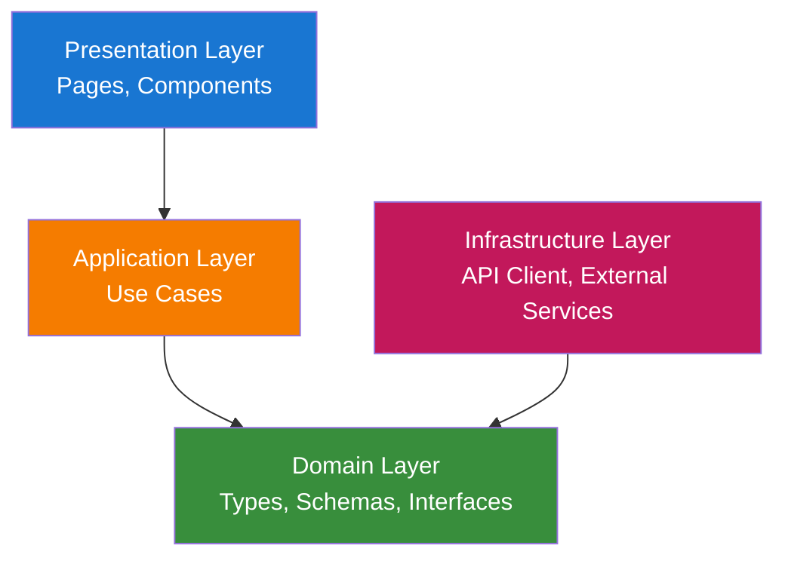
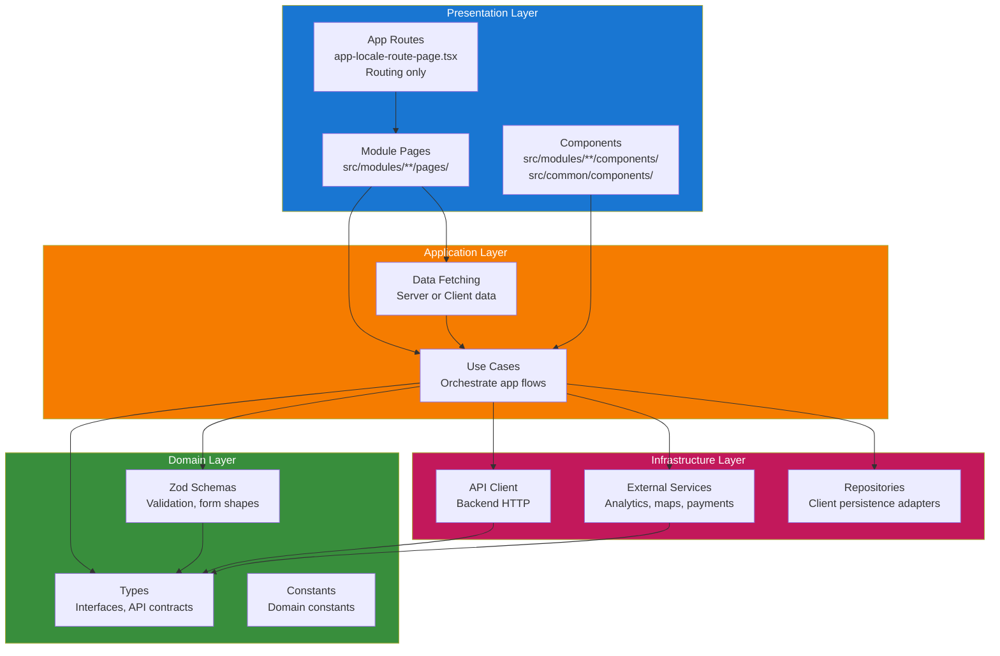
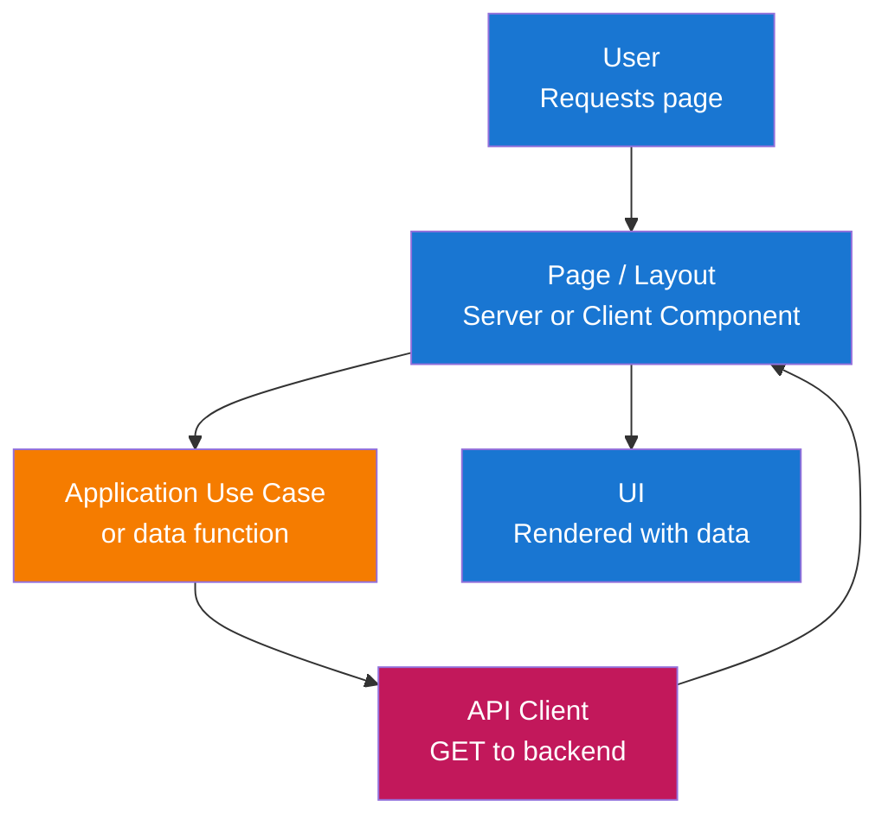
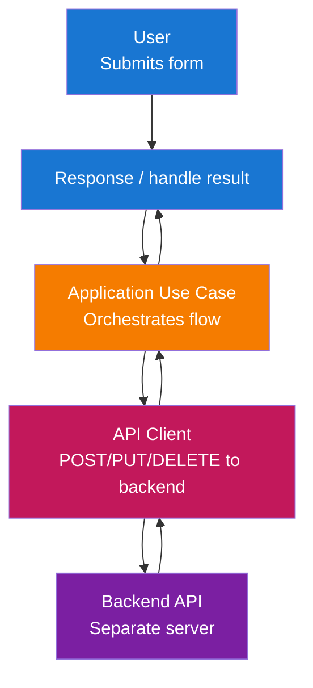

# Architecture

本前端遵循 **Clean Architecture** 与 **module** 结构。应用易于维护、可测试，并与 Next.js 及所选 UI 技术栈对齐。

## Architecture Overview

解决方案按 layer 组织，实现关注点分离与依赖反转：



**Layer 说明：**

- **Presentation Layer**：用户交互入口——Next.js 页面、布局与 React components。该 layer 负责渲染 UI 与处理输入，将业务与数据逻辑委托给 application layer。

- **Application Layer**：编排 use case 与应用逻辑——数据获取、表单提交、validation 编排及 domain 规则与 infrastructure 的协调。此处无 UI 与框架细节。

- **Domain Layer**：Types、Zod schemas 与 interfaces，供全应用使用。无外部依赖；定义数据形态与 validation 规则（如 API contracts、form payloads）。

- **Infrastructure Layer**：技术实现——API client（HTTP 访问后端）与外部服务。实现 application 或 domain layer 定义的 interface。

## Layer 结构

包含所有 components 的完整 layer 结构：



## 数据流

### 读流（Server 或 Client 页面）



### 写流（表单提交）



## 层次职责

### 1. Domain Layer（`src/modules/{module}/domain/` 或 `src/common/domain/`）

核心类型与校验，无外部依赖。

**组成：**

- **Types**：API 响应、表单状态及全局概念的接口与类型别名（如 `User`、`Session`、`ApiError`）。
- **Zod Schemas**：表单校验与解析；位于 `src/common/domain/schemas/` 或每模块 `domain/schemas.ts`。
- **Constants**：领域相关常量（如路由路径、错误码）供全应用使用。

**原则：**

- 不依赖其他层或框架。
- 仅类型与模式；无 I/O、无 React、无 Next。

### 2. Application Layer（`src/modules/{module}/application/` 或 `src/common/application/`）

编排用例与应用逻辑。

**组成：**

- **Use Cases**：实现应用流程的函数或类（如 `loginUser()`、`fetchUserProfile()`）。使用 domain types/schemas 与 infrastructure（API client）。
- **Stores**：module 级状态容器（如 Zustand slice），协调 UI 状态与 use case。
- **Data-fetching helpers**：供 Server/Client components 通过 use case/API client 加载数据的函数。

**原则：**

- 仅依赖 Domain 与 Infrastructure（在合适处通过 interface）。
- 无 UI、无 React hooks、核心逻辑中无 Next 专用 API；仅编排。

### 3. Infrastructure Layer（`src/modules/{module}/infrastructure/` 或 `src/common/infrastructure/`）

实现技术关注点与外部集成。

**组成：**

- **API Client**：后端 HTTP client（fetch 或封装）。实现 application layer 期望的 contract。
- **Services**：外部集成（分析、地图、支付等）。
- **Repositories**：客户端持久化适配器（localStorage、IndexedDB、cookies）。
- **External SDKs**：服务或仓库使用的第三方库。

**原则：**

- 实现 application layer 使用的 interface 或 contract。
- 所有外部 I/O 与框架相关细节在此层。

### 4. Presentation Layer（页面、组件）

处理用户交互并渲染 UI。

**组成：**

- **App Routes**：`app/[locale]/**/page.tsx` 仅作 routing layer。这些文件从 `src/modules/{module}/pages/` 导入并渲染 page component。
- **Module Pages**：`src/modules/{module}/pages/` 存放实际 page components。页面依数据与 hooks 需求可为 Server 或 Client Component。
- **Components**：module 专用 components 在 `src/modules/{module}/components/`；共享 components 在 `src/common/components/`（含 `ui/` 的 shadcn）。Component 可为 Server 或 Client；仅在需要时使用 `"use client"`。

**原则：**

- 依赖 Application（及仅通过 types/schemas 的 Domain）。
- 与框架绑定：Next.js App Router、React。业务逻辑保留在 application layer。
- `/app` 仅负责 routing；代码均在 `/src`。

## Module 结构

应用以 `/src` 为主源码目录，`/app` 仅作 routing layer。代码按 **module**（功能）组织于 `/src`，共享代码在 `/src/common`。

### 项目结构概览

```text
app/                               # 仅路由层（Next.js App Router）
└── [locale]/                      # 语言段（next-intl）
    ├── layout.tsx                 # 从 src/common 导入 RootLayout
    ├── page.tsx                   # 从 src/modules/landing-page 导入 LandingPage
    ├── auth/
    │   ├── sign-in/
    │   │   └── page.tsx           # 从 src/modules/auth 导入 SignInPage
    │   ├── sign-up/
    │   │   └── page.tsx           # 从 src/modules/auth 导入 SignUpPage
    │   └── forgot-password/
    │       └── page.tsx           # 从 src/modules/auth 导入 ForgotPasswordPage

src/                               # 应用代码均在此
├── application/                   # 应用级配置（next-intl）
│   ├── localization/              # next-intl 翻译
│   │   ├── en.json
│   │   └── {locale}.json
│   ├── routing/                   # next-intl 路由配置
│   │   ├── routing.ts             # 语言路由配置
│   │   └── request.ts             # getTranslations 请求配置
│   └── configurations/            # 应用级配置
├── common/                        # 跨模块共享代码
│   ├── components/                # 公共组件
│   │   ├── ui/                    # shadcn/ui 组件
│   │   ├── layout/                # 布局组件（Header、Footer、Sidebar）
│   │   └── ...                    # 其他共享组件
│   ├── domain/                    # 共享领域层
│   │   ├── types.ts               # 共享类型（User、Session、ApiError）
│   │   └── schemas.ts             # 共享 Zod 模式
│   ├── application/               # 共享应用层
│   │   └── services/              # 共享服务（如有）
│   ├── infrastructure/            # 共享基础设施
│   │   ├── api-client.ts          # 后端 HTTP 客户端
│   │   ├── services/              # 外部服务（分析、地图等）
│   │   └── repositories/          # 客户端持久化（localStorage、IndexedDB）
│   ├── stores/                    # Zustand 仓库（仅客户端）
│   ├── hooks/                     # 共享 React hooks
│   ├── utils/                     # 工具（cn()、格式化等）
│   └── config/                    # 应用配置
│
├── modules/                       # 功能模块
│   ├── auth/                      # 认证模块
│   │   ├── domain/
│   │   │   ├── types.ts           # 认证相关类型
│   │   │   └── schemas.ts         # 认证 Zod 模式（登录、注册）
│   │   ├── application/
│   │   │   ├── use-cases/         # 认证用例
│   │   │   └── stores/            # 模块状态仓库
│   │   ├── infrastructure/       # 模块基础设施（结构同 common）
│   │   │   ├── api-client.ts      # 模块 API 客户端方法（可选）
│   │   │   ├── services/          # 模块外部服务
│   │   │   └── repositories/     # 模块客户端持久化
│   │   ├── pages/                 # 页面（每页一目录）
│   │   │   ├── sign-in/
│   │   │   │   ├── page.tsx        # 登录页组件
│   │   │   │   └── components/     # 登录页子组件
│   │   │   ├── sign-up/
│   │   │   │   ├── page.tsx        # 注册页组件
│   │   │   │   └── components/     # 注册页子组件
│   │   │   └── forgot-password/
│   │   │       ├── page.tsx        # 忘记密码页组件
│   │   │       └── components/     # 忘记密码页子组件
│   │   └── components/            # 模块内共享组件
│   │
│   └── {module-name}/             # 其他模块结构相同
│       ├── domain/
│       ├── application/
│       ├── infrastructure/
│       ├── pages/
│       └── components/
```

### App Routes（仅路由层）

`/app` 目录仅包含 Next.js 路由文件，从 `/src` 导入：

```tsx
// app/[locale]/auth/sign-in/page.tsx
import { SignInPage } from "@/modules/auth/pages/sign-in/page";

export default function Page() {
  return <SignInPage />;
}
```

```tsx
// app/[locale]/layout.tsx
import { RootLayout } from "@/common/components/layout/root-layout";

export default function Layout({ children }: { children: React.ReactNode }) {
  return <RootLayout>{children}</RootLayout>;
}
```

这样保持 `/app` 最小化，代码集中在 `/src`，便于组织与测试。

## 关键设计模式

### 1. Clean Architecture / Layered Architecture

**目的**：关注点分离与依赖反转（inner layer 不依赖 outer layer）。

**实现：**

- **Domain**：types、Zod schemas、constants——无框架、无 I/O。
- **Application**：use case；仅依赖 Domain 与 Infrastructure interface。
- **Infrastructure**：API client 与外部集成；实现 Application 所需。
- **Presentation**：pages 与 components；依赖 Application（及 Domain types）。

**收益：**

- 可测性：应用与领域逻辑可在无 UI、无真实 HTTP 下测试。
- 可维护性：单 layer 变更影响范围小。
- 灵活性：可更换 API client 或认证实现而不改 use case。

### 2. Modular feature structure

**目的**：将功能（认证、仪表盘、设置）分组并保持边界清晰。

**实现：**

- 代码均在 `/src`；`/app` 仅负责 routing。
- 按功能在 `src/modules/{feature}/` 分组，含 `pages/`、`components/`、`domain/`、`application/`。
- 共享代码（API client、认证、UI、stores）在 `src/common/`。

**收益：**

- 职责清晰、易于查找。
- 与后端模块心智模型一致，无需完整 DDD。
- 代码与 routing 分离，更易测试。

### 3. API Client 抽象（Infrastructure）

**目的**：集中后端通信，使 application layer 独立于 HTTP 细节。

**实现：**

- `src/common/infrastructure/api-client.ts` 中的 API client 暴露如 `getUser()`、`login(credentials)` 等 method。
- 在适用处使用 domain types 表示 request/response。
- Application services 调用 API client，而非直接 `fetch`。

**收益：**

- 测试中易 mock，后续可更换后端 URL 或传输方式。

### 4. Zod 校验与 Types（Validation and inferred types）

**目的**：validation 与 inferred types 的单一来源。

**实现：**

- Zod schemas 在 `src/common/domain/schemas/`（共享）或每 module `src/modules/{module}/domain/schemas.ts`。
- 通过 `zodResolver(schema)` 与 React Hook Form 配合。
- 使用 `z.infer<typeof schema>` 导出 types。

**收益：**

- 客户端 validation 一致；由 schemas 得到 type safety。

### 5. Dependency Injection / Interfaces（可选）

**目的**：在需要时松耦合与可测性。

**实现：**

- Application services 通过 constructor 或函数参数接收 API client 或外部服务 client。
- 测试中传入 mock；应用中传入 `src/common/infrastructure/` 的真实 implementation。

**收益：**

- 单元测试更简单，可替换实现（如 storybook 或测试用 mock API）。

## Technology Stack

- **Framework**：Next.js（App Router）、React
- **Language**：TypeScript（strict mode）
- **UI**：shadcn/ui（Radix UI + Tailwind CSS）
- **State**：Zustand（client-only global state）
- **Forms**：React Hook Form + Zod（`@hookform/resolvers/zod`）
- **Validation**：Zod（form validation）
- **i18n**：next-intl（locale-based routing、messages、`getTranslations` / `useTranslations`）
- **DI**：Awilix（dependency injection）
- **Testing**：Vitest（及适用的 React Testing Library）

## Next.js 与约定

### App Router（仅 routing）

- **Routes**：`app/[locale]/{segment}/page.tsx` 负责 routing；这些文件从 `src/modules/{module}/pages/` 导入 page component。
- **/app 中无业务代码**：业务逻辑、components 与 services 均在 `/src`。`/app` 仅处理 Next.js routing。
- **Server vs Client**：pages 与 components 可为 Server 或 Client Component。默认 Server；仅在使用 hooks、browser APIs 或 Zustand 时加 `"use client"`。
- **Client boundary**：尽量将 `"use client"` 放在 leaf component 或小包装上。

### 数据获取与变更

- **Server Components**：通过 application layer（`src/modules/{module}/application/use-cases/` 中的 use case）获取数据；在表示 use case 时不在 component 内直接 `fetch`。
- **Client Components**：变更（form）时调用 application services，由 API client 与独立后端 API 通信。Client Component 也可在需要时通过 use case 获取数据。
- **Forms**：用 Zod（React Hook Form）validation 后，调用 application services 提交到后端。

### 文件与目录约定

- **文件与目录均使用 kebab-case**（小写连字符），Next.js 保留路由文件（如 `page.tsx`、`layout.tsx`）除外。
- **有 props 的 component 必须定义 props type**并在 component 签名中使用。
- **无 props 的 component**不定义 props type、不包含 props 参数。
- `app/`——仅 routing（page.tsx、layout.tsx、loading、error、not-found）；在 next-intl 的 `app/[locale]/` 下。从 `/src` 导入。
- `src/application/`——next-intl 配置（localization、routing）。
- `src/common/components/`——共享 components；`src/common/components/ui/` 为 shadcn。
- `src/common/infrastructure/`——API client、services、repositories。
- `src/common/domain/`——共享 types 与 schemas（文件形式）。
- `src/common/stores/`——Zustand stores（仅 client）。
- `src/common/utils/`——工具（`cn()`、formatters 等）。
- `src/modules/{module}/`——功能 module 的 pages、components、domain、application。
- `src/application/localization/`——next-intl 按 locale 的 JSON 翻译文件。
- `src/application/routing/`——next-intl routing 与 request 配置。

### 表单与校验

- 使用 React Hook Form + Zod（`zodResolver(schema)`）及 `src/common/components/ui/` 的 shadcn Form component。
- Submit 时调用 application services，由 API client 将数据发往后端。
- 处理 API 错误并视需要映射到表单状态。

### 国际化（next-intl）

- 基于语言的路由：`app/[locale]/...`；中间件检测语言。
- Server：`getTranslations('namespace')`；Client：`useTranslations('namespace')`。
- 使用 next-intl 的 `Link` 与 `useRouter` 做语言感知导航。
