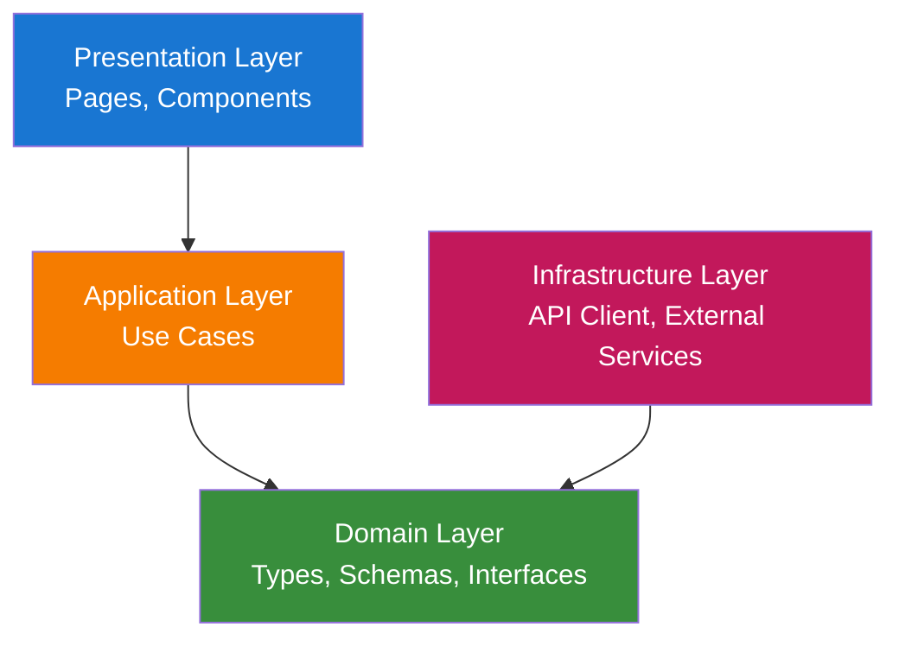
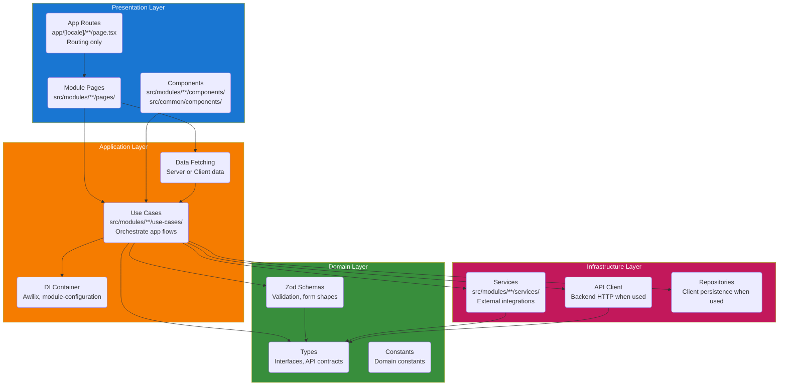
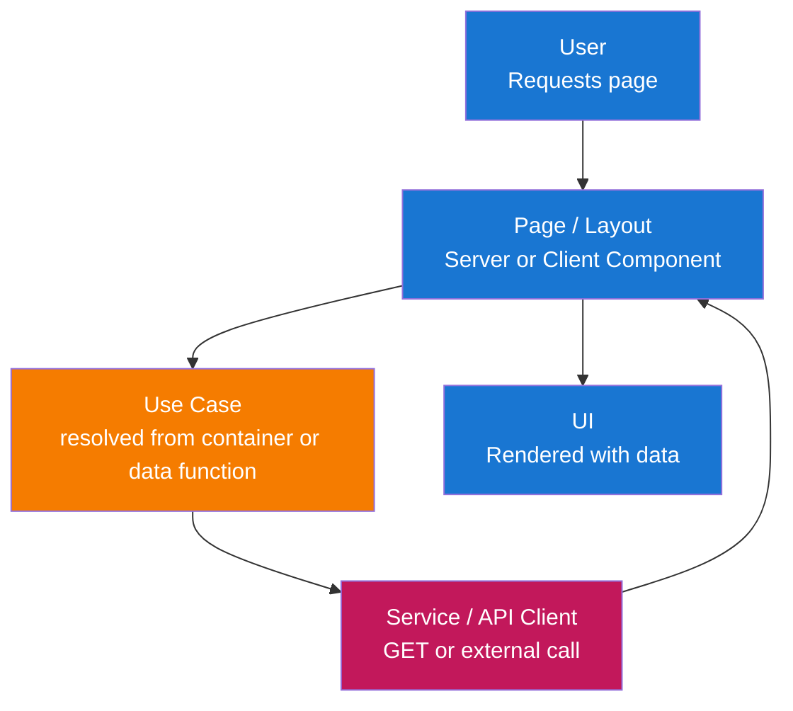
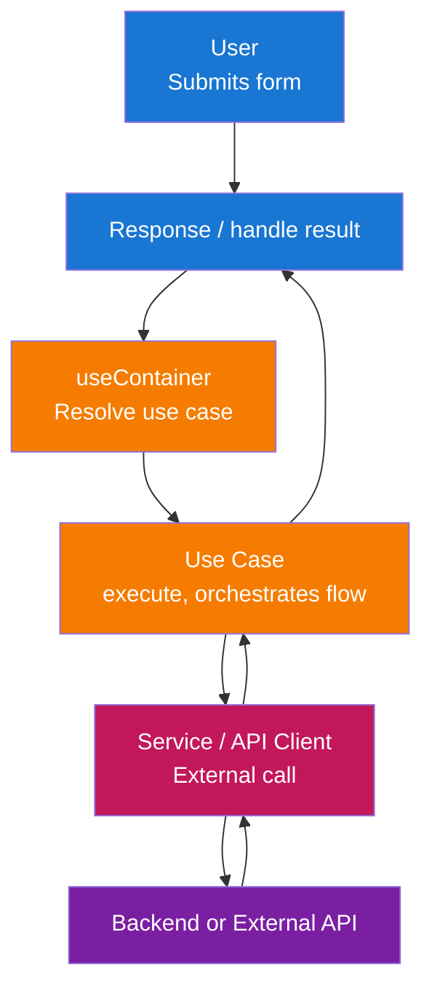

# Architecture

本前端遵循 **Clean Architecture** 与 **module** 结构。应用易于维护、可测试，并与 Next.js 及所选 UI 技术栈对齐。

## Architecture Overview

解决方案按 layer 组织，实现关注点分离与依赖反转：



**Layer 说明：**

- **Presentation Layer**：用户交互入口——Next.js 页面、布局与 React components。该 layer 负责渲染 UI 与处理输入，将业务与数据逻辑委托给 application layer。

- **Application Layer**：编排 use case 与应用逻辑——数据获取、表单提交、validation 编排及 domain 规则与 infrastructure 的协调。此处无 UI 与框架细节。

- **Domain Layer**：Types、Zod schemas 与 interfaces，供全应用使用。无外部依赖；定义数据形态与 validation 规则（如 API contracts、form payloads）。

- **Infrastructure Layer**：技术实现——API client（HTTP 访问后端）与外部服务。实现 application 或 domain layer 定义的 interface。

## Layer 结构

包含所有 components 的完整 layer 结构：



## 数据流

### 读流（Server 或 Client 页面）



### 写流（表单提交）



## 层次职责

### 1. Domain Layer（`src/modules/{module}/domain/`）

核心类型与校验，无外部依赖。共享领域概念可放在模块 domain 或 common interfaces。

**组成：**

- **Types**：API 响应、表单状态及模块概念的接口与类型别名（如 `src/modules/auth/domain/types.ts` 中的 auth 类型）。
- **Zod Schemas**：每模块 `domain/schemas.ts` 中的表单校验与解析。
- **Constants**：领域相关常量（如路由路径、错误码）在模块内使用。

**原则：**

- 不依赖其他层或框架。
- 仅类型与模式；无 I/O、无 React、无 Next。

### 2. Application Layer（`src/modules/{module}/use-cases/` + DI）

编排用例与应用逻辑。用例从 Awilix 容器解析；模块通过 `module-configuration.ts` 注册。

**组成：**

- **Use Cases**：`src/modules/{module}/use-cases/` 中的类（或函数）实现应用流程（如 `SignInWithEmailUseCase`、`UpdateProfileUseCase`）。继承 `src/common/utils/base-use-case.ts` 的 `BaseUseCase`，使用 domain types/schemas，通过容器依赖 services 或 API client。
- **Module state**：模块级状态（如 Zustand）通过 `src/modules/{module}/hooks/` 中的 hooks 暴露（如 `use-auth-user-store.ts`）。
- **Data-fetching**：Server 或 Client Components 通过从容器解析并调用 use case 加载数据。

**原则：**

- 仅依赖 Domain 与 Infrastructure（通过 Awilix 注入）。
- Use case 类中无 UI、无 React；仅编排。

### 3. Infrastructure Layer（`src/modules/{module}/services/`）

实现技术关注点与外部集成。需要时可有每模块 API client 或 repositories。

**组成：**

- **Services**：`src/modules/{module}/services/` 中的外部集成（如 auth 中的 `FirebaseAuthenticationService`）。实现 `src/modules/{module}/interfaces/` 中定义的 interface。
- **API Client**：当应用与后端 HTTP API 通信时，client 可放在 `src/common/` 或每模块，并在容器中注册。
- **Repositories**：需要时的客户端持久化适配器（localStorage、IndexedDB、cookies）。

**原则：**

- 实现 use case 使用的 interface（通过容器注入）。
- 所有外部 I/O 与 SDK 使用在此层。

### 4. Presentation Layer（页面、组件）

处理用户交互并渲染 UI。

**组成：**

- **App Routes**：`app/[locale]/**/page.tsx`（及 route group 如 `(marketing)`）仅作 routing layer。从 `src/modules/{module}/pages/` 导入并渲染 page component。
- **Module Pages**：`src/modules/{module}/pages/{page}/page.tsx` 存放实际 page components。页面可为 Server 或 Client Component；页面专属组件在 `pages/{page}/components/`。
- **Components**：模块共享组件在 `src/modules/{module}/components/`；共享组件在 `src/common/components/`（如 form、input、label、root-layout、main-layout）。仅在需要时使用 `"use client"`（hooks、browser APIs、Zustand）。

**原则：**

- 依赖 Application（通过容器的 use case）和 Domain（仅 types）。
- 与框架绑定：Next.js App Router、React。业务逻辑保留在 use case 与 services。
- `/app` 仅负责 routing；应用代码均在 `/src`。

## Module 结构

应用以 `/src` 为主源码目录，`/app` 仅作 routing layer。代码按 **module**（功能）组织于 `/src`，共享代码在 `/src/common`。

### 项目结构概览

```text
app/                               # 仅路由层（Next.js App Router）
├── [locale]/                      # 语言段（next-intl）
│   ├── layout.tsx                 # 根布局：AppInitializer、SyncAuthState、RootLayout、Toaster
│   ├── error.tsx                   # 错误边界
│   ├── not-found.tsx               # 未找到处理
│   ├── (marketing)/                # 路由组：营销页
│   │   ├── layout.tsx              # MainLayout 含菜单、AuthHeaderSlot
│   │   ├── page.tsx                # 落地页（landing-page 模块的 LandingPage）
│   │   ├── docs/
│   │   │   └── [slug]/
│   │   │       └── page.tsx        # docs 模块的文档页
│   │   ├── privacy-policy/
│   │   │   └── page.tsx            # legal 模块
│   │   └── terms-of-service/
│   │       └── page.tsx            # legal 模块
│   ├── app/
│   │   └── page.tsx                # main 模块的 app 页
│   └── auth/
│       ├── layout.tsx              # auth 模块的 AuthLayout
│       ├── sign-in/
│       │   └── page.tsx            # auth 模块的 SignInPage
│       ├── sign-up/
│       │   └── page.tsx            # auth 模块的 SignUpPage
│       ├── forgot-password/
│       │   └── page.tsx            # auth 模块的 ForgotPasswordPage
│       └── profile/
│           └── page.tsx            # auth 模块的 profile 页
├── globals.css                     # 全局样式
├── layout.tsx                      # 根应用布局
└── not-found.tsx                   # 根 not-found 回退

src/                               # 应用代码均在此
├── __tests__/                      # 测试镜像 src（application/、common/、modules/）+ test-utils/
├── application/                   # 应用级设置
│   ├── components/                 # 应用级组件（如 AppInitializer）
│   ├── config/                     # 应用配置（firebase-config、main-menu）
│   ├── i18n/                       # next-intl 请求辅助（getRequestConfig）
│   ├── localization/               # next-intl 翻译 JSON（en、vi、zh）
│   └── register-container.ts      # Awilix 容器注册、模块注册
├── common/                        # 跨模块共享代码
│   ├── components/                 # 共享组件（扁平）
│   │   ├── button.tsx              # Button、Card、Dialog、Form、Input、Label
│   │   ├── root-layout.tsx         # RootLayout
│   │   ├── main-layout.tsx         # MainLayout、MainHeader
│   │   ├── toaster.tsx             # Toaster（Sonner）
│   │   └── ...                     # app-initializer、back-to-home-button、icons 等
│   ├── hooks/                      # 共享 hooks（如 use-container）
│   ├── interfaces/                 # 共享接口（如 menu-item）
│   ├── pages/                      # 共享页面组件（error-page、not-found-page）
│   ├── routing/                    # next-intl 路由
│   │   ├── routing.ts              # 语言、路由配置
│   │   ├── navigation.ts           # Link、useRouter、usePathname
│   │   └── request.ts              # getRequestConfig 消息（使用 application/localization）
│   └── utils/                      # 工具（cn、container、base-use-case、menu、read-doc）
│
├── modules/                       # 功能模块
│   ├── auth/                       # 认证模块（Firebase、sign-in、sign-up、profile）
│   │   ├── domain/
│   │   │   ├── types.ts            # 认证类型
│   │   │   └── schemas.ts          # 认证 Zod 模式（login、register、profile）
│   │   ├── use-cases/              # 认证用例（sign-in、sign-up、sign-out 等）
│   │   ├── services/               # Firebase 认证服务（实现认证接口）
│   │   ├── interfaces/             # BaseAuthenticationService 接口
│   │   ├── hooks/                  # use-auth-user-store、use-sync-auth-state
│   │   ├── components/             # AuthLayout、AuthVerification、SyncAuthState、AuthHeaderSlot
│   │   ├── pages/                  # 页面（每页一目录）
│   │   │   ├── sign-in/
│   │   │   │   ├── page.tsx        # 登录页
│   │   │   │   └── components/     # sign-in-form
│   │   │   ├── sign-up/
│   │   │   │   ├── page.tsx        # 注册页
│   │   │   │   └── components/     # sign-up-form
│   │   │   ├── forgot-password/
│   │   │   │   ├── page.tsx        # 忘记密码页
│   │   │   │   └── components/     # forgot-password-form
│   │   │   └── profile/
│   │   │       ├── page.tsx        # 个人资料页
│   │   │       └── components/     # profile-form
│   │   ├── utils/                  # map-auth-error 等
│   │   └── module-configuration.ts # Awilix：注册认证服务与用例
│   │
│   ├── docs/                       # 文档模块（按 slug 的 markdown）
│   │   ├── components/             # MarkdownContent、MermaidDiagram
│   │   ├── pages/doc/page.tsx      # 文档页组件
│   │   └── module-configuration.ts
│   ├── landing-page/               # 落地页模块
│   │   ├── pages/home/             # 首页 + scroll-reveal 组件
│   │   └── module-configuration.ts
│   ├── legal/                      # 法律页（privacy、terms）
│   │   ├── pages/privacy-policy/   # 与 terms-of-service
│   │   └── module-configuration.ts
│   ├── main/                       # 主应用页（登录后）
│   │   ├── pages/app/page.tsx
│   │   └── module-configuration.ts
│   │
│   └── {module-name}/             # 新模块结构相同
│       ├── domain/                 # types.ts、schemas.ts（需要时）
│       ├── use-cases/              # 用例类，经容器解析
│       ├── services/               # 外部服务（需要时）
│       ├── interfaces/            # 服务/端口接口（需要时）
│       ├── hooks/                  # 模块状态 hooks（需要时）
│       ├── components/            # 模块共享组件
│       ├── pages/                  # pages/{page}/page.tsx + components/
│       ├── utils/                  # 模块工具（需要时）
│       └── module-configuration.ts # registerModule(container)
```

### App Routes（仅路由层）

`/app` 目录仅包含 Next.js 路由文件，从 `/src` 导入：

```tsx
// app/[locale]/auth/sign-in/page.tsx
import { SignInPage } from "@/modules/auth/pages/sign-in/page";

export default function Page() {
  return <SignInPage />;
}
```

```tsx
// app/[locale]/layout.tsx
import { AppInitializer } from "@/application/components/app-initializer";
import { RootLayout } from "@/common/components/root-layout";
import { Toaster } from "@/common/components/toaster";
import { SyncAuthState } from "@/modules/auth/components/sync-auth-state";

export default async function LocaleLayout({ children, params }: { ... }) {
  // ... next-intl 设置
  return (
    <NextIntlClientProvider locale={locale} messages={messages}>
      <AppInitializer />
      <SyncAuthState />
      <RootLayout>{children}</RootLayout>
      <Toaster />
    </NextIntlClientProvider>
  );
}
```

路由组（如 `(marketing)`）使用共享 layout 提供带菜单与 auth slot 的 MainLayout；auth 路由使用 AuthLayout。这样保持 `/app` 最小化，代码集中在 `/src`，便于组织与测试。

## 关键设计模式

### 1. Clean Architecture / Layered Architecture

**目的**：关注点分离与依赖反转（inner layer 不依赖 outer layer）。

**实现：**

- **Domain**：types、Zod schemas、constants——无框架、无 I/O。
- **Application**：use case（在 `use-cases/`）；仅依赖 Domain 与 Infrastructure interface，经 Awilix 解析。
- **Infrastructure**：Services（在 `services/`）与可选 API client；实现 use case 使用的 interface。
- **Presentation**：pages 与 components；依赖 Application（及 Domain types）。

**收益：**

- 可测性：应用与领域逻辑可在无 UI、无真实 HTTP 下测试。
- 可维护性：单 layer 变更影响范围小。
- 灵活性：可更换 API client 或认证实现而不改 use case。

### 2. Modular feature structure

**目的**：将功能（auth、docs、landing、legal、main）分组并保持边界清晰。

**实现：**

- 代码均在 `/src`；`/app` 仅负责 routing。
- 按功能在 `src/modules/{feature}/` 分组，含 `domain/`、`use-cases/`、`services/`、`interfaces/`、`hooks/`、`components/`、`pages/`、`utils/` 及用于 DI 注册的 `module-configuration.ts`。
- 共享代码（components、hooks、routing、utils、container）在 `src/common/`。应用级设置（容器注册、config、i18n、localization）在 `src/application/`。

**收益：**

- 职责清晰、易于查找。
- 与后端模块心智模型一致，无需完整 DDD。
- 代码与 routing 分离、use case 经容器解析，更易测试。

### 3. Dependency Injection（Awilix）

**目的**：从容器解析 use case 与 services，使 components 解耦且可测。

**实现：**

- 容器在 `src/common/utils/container.ts` 创建，在 `src/application/register-container.ts` 注册。
- 各模块在 `module-configuration.ts` 中暴露 `registerModule(container)`，注册 use case 与 services（如 `asClass(SignInWithEmailUseCase).singleton()`）。
- Components 通过 `src/common/hooks/use-container.ts` 的 `useContainer()` 解析 use case 并调用 `execute()`。
- 应用级依赖（如 Firebase auth 实例）在 `register-container.ts` 注册。

**收益：**

- Use case 与 services 在测试中可 mock；Server 与 Client Components 共用同一 API。

### 4. API Client / External Services（Infrastructure）

**目的**：集中后端或外部通信，使 use case 独立于 HTTP/SDK 细节。

**实现：**

- 当应用与后端 API 通信时，API client 可放在 `src/common/` 或每模块，并在容器中注册。使用 domain types 表示 request/response。
- 外部集成（如 Firebase）在 `src/modules/{module}/services/`，实现 `src/modules/{module}/interfaces/` 中的 interface。Use case 依赖这些 interface，经容器接收实现。

**收益：**

- 测试中易 mock，可更换后端 URL 或实现。

### 5. Zod 校验与 Types

**目的**：validation 与 inferred types 的单一来源。

**实现：**

- 每模块 Zod schemas 在 `src/modules/{module}/domain/schemas.ts`。
- 通过 `zodResolver(schema)` 与 React Hook Form 配合。
- 使用 `z.infer<typeof schema>` 导出 types。

**收益：**

- 客户端 validation 一致；由 schemas 得到 type safety。

### 6. Interfaces for Infrastructure

**目的**：use case 与外部服务间松耦合。

**实现：**

- Interface（如 `BaseAuthenticationService`）在 `src/modules/{module}/interfaces/`。Use case 依赖这些 interface；实现（如 `FirebaseAuthenticationService`）在 `services/` 并在容器中注册。

**收益：**

- 单元测试更简单，可替换实现（如测试中 mock auth）。

## Technology Stack

- **Framework**：Next.js（App Router）、React
- **Language**：TypeScript（strict mode）
- **UI**：shadcn 风格组件（Radix UI + Tailwind CSS、CVA、clsx、tailwind-merge）
- **State**：Zustand（仅客户端状态，如 auth user store）
- **Forms**：React Hook Form + Zod（`@hookform/resolvers/zod`）
- **Validation**：Zod（form validation）
- **i18n**：next-intl（locale-based routing、messages、`getTranslations` / `useTranslations`）
- **DI**：Awilix（container、`register-container.ts`、每模块 `module-configuration.ts`）
- **Auth**：Firebase（可选；auth 模块使用 Firebase Authentication）
- **Toasts**：Sonner（经 root layout 中的 Toaster）
- **Testing**：Vitest 与 React Testing Library（测试在 `src/__tests__/`）

## Next.js 与约定

### App Router（仅 routing）

- **Routes**：`app/[locale]/{segment}/page.tsx` 负责 routing；这些文件从 `src/modules/{module}/pages/` 导入 page component。
- **/app 中无业务代码**：业务逻辑、components 与 services 均在 `/src`。`/app` 仅处理 Next.js routing。
- **Server vs Client**：pages 与 components 可为 Server 或 Client Component。默认 Server；仅在使用 hooks、browser APIs 或 Zustand 时加 `"use client"`。
- **Client boundary**：尽量将 `"use client"` 放在 leaf component 或小包装上。

### 数据获取与变更

- **Server Components**：经 use case（在 `src/modules/{module}/use-cases/`，需要时从容器解析）获取数据；在表示 use case 时不在 component 内直接 `fetch`。
- **Client Components**：变更（form）时经 `useContainer()` 解析 use case 并调用 `execute()`。Use case 使用 services 或 API client 与后端或外部 API 通信。Client Component 也可在需要时经 use case 获取数据。
- **Forms**：用 Zod（React Hook Form）validation 后，调用 application services 提交到后端。

### 文件与目录约定

- **文件与目录均使用 kebab-case**（小写连字符），Next.js 保留路由文件（如 `page.tsx`、`layout.tsx`）除外。
- **有 props 的 component 必须定义 props type**并在 component 签名中使用。
- **无 props 的 component**不定义 props type、不包含 props 参数。
- `app/`——仅 routing（page.tsx、layout.tsx、error.tsx、not-found.tsx）；在 next-intl 的 `app/[locale]/` 下，可选 route group（如 `(marketing)`）。从 `/src` 导入。
- `src/application/`——应用级设置：components（AppInitializer）、config（firebase-config、main-menu）、i18n（request）、localization（翻译 JSON）、register-container。
- `src/common/components/`——共享组件（扁平：button、card、dialog、form、input、label、root-layout、main-layout、toaster 等）。
- `src/common/hooks/`——共享 hooks（如 use-container）。
- `src/common/interfaces/`——共享接口（如 menu-item）。
- `src/common/pages/`——共享页面组件（error-page、not-found-page）。
- `src/common/routing/`——next-intl routing（routing.ts）、navigation（Link、useRouter、usePathname）、request（getRequestConfig messages）。
- `src/common/utils/`——工具（cn、container、base-use-case、menu、read-doc）。
- `src/modules/{module}/`——功能模块：domain、use-cases、services、interfaces、hooks、components、pages、utils、module-configuration.ts。
- `src/application/localization/`——next-intl 按 locale 的 JSON 翻译文件（en、vi、zh）。
- `src/__tests__/`——测试镜像 src（application/、common/、modules/）。

### 表单与校验

- 使用 React Hook Form + Zod（`zodResolver(schema)`）及 `src/common/components/` 的 Form component。
- Submit 时经 `useContainer()` 解析对应 use case 并调用 `execute()` 传入已校验表单数据。Use case 委托给 services 或 API client。
- 处理 API 错误并视需要映射到表单状态（如经模块 utils 如 `map-auth-error`）。

### 国际化（next-intl）

- 基于语言的路由：`app/[locale]/...`；中间件检测语言。
- Server：`getTranslations('namespace')`；Client：`useTranslations('namespace')`。
- 使用 next-intl 的 `Link` 与 `useRouter` 做语言感知导航。
