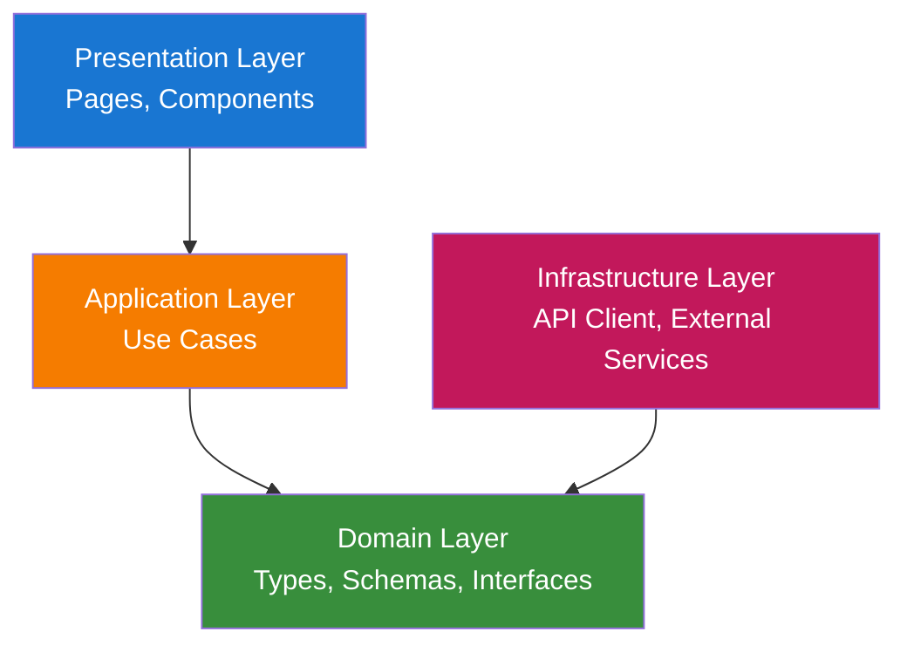
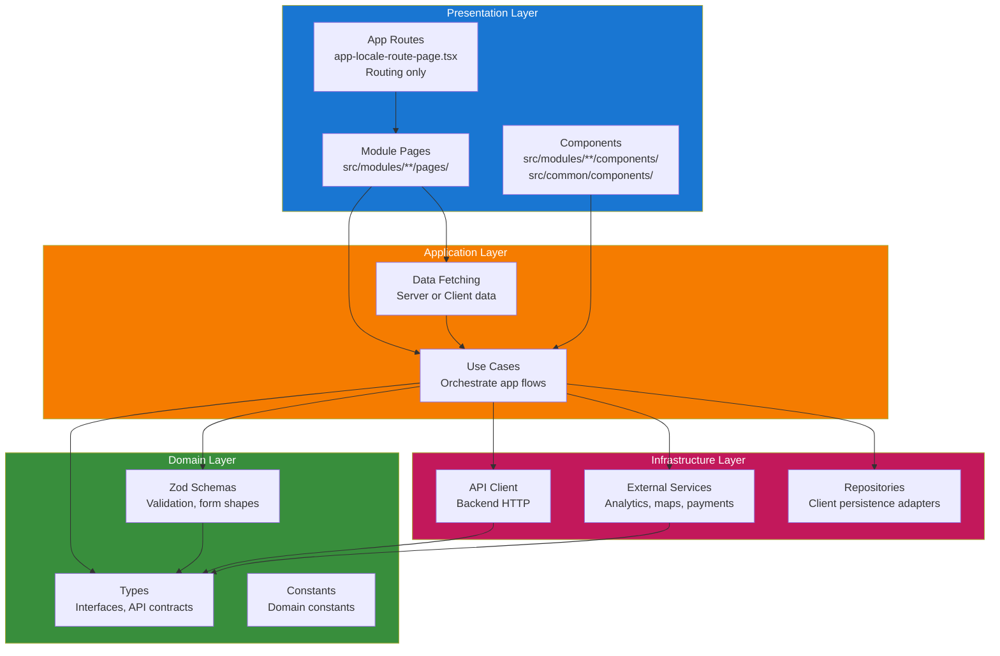
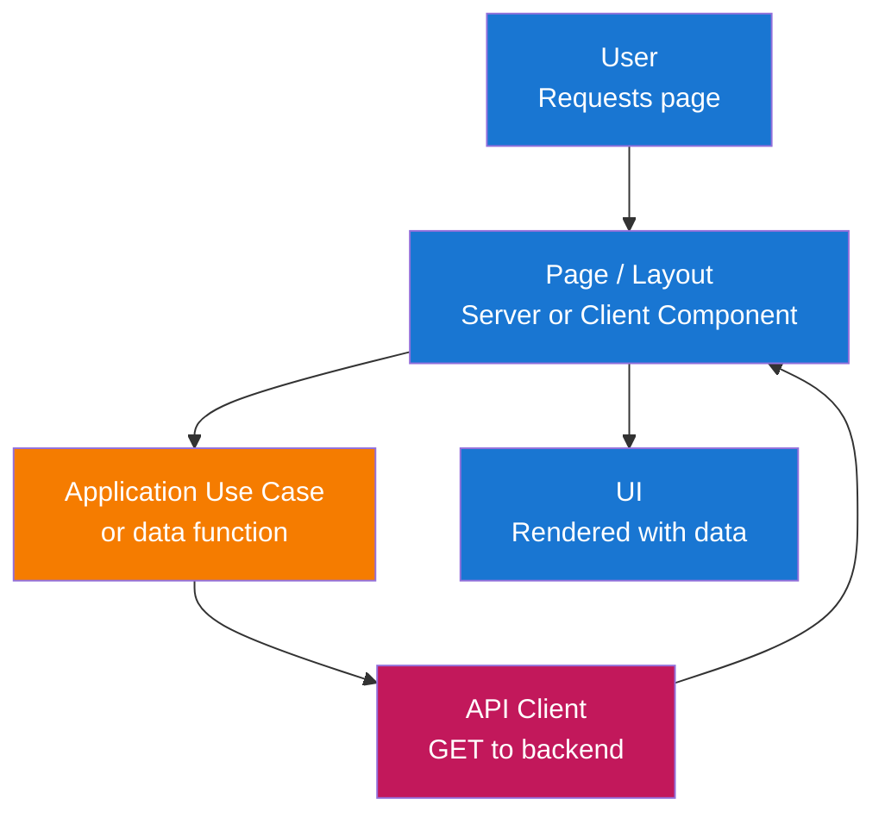
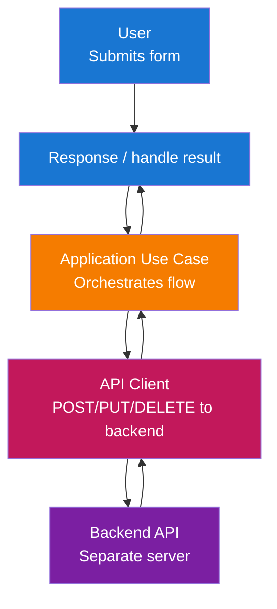

# Architecture

This frontend follows **Clean Architecture** with a **modular** structure. The application is maintainable, testable, and aligned with Next.js and the chosen UI stack.

## Architecture Overview

The solution is organized into layers that enforce separation of concerns and dependency inversion:



**Layer Descriptions:**

- **Presentation Layer**: Entry points for user interaction—Next.js pages, layouts, and React components. This layer renders UI and handles user input, delegating business and data logic to the application layer.

- **Application Layer**: Orchestrates use cases and application logic—data fetching, form submission handling, validation orchestration, and coordination between domain rules and infrastructure. No UI or framework specifics here.

- **Domain Layer**: Core types, Zod schemas, and interfaces used across the app. No external dependencies; defines the shape of data and validation rules (e.g. API contracts, form payloads).

- **Infrastructure Layer**: Technical implementations—API client (HTTP to backend) and external services. Implements interfaces defined by the application or domain layer.

## Layer Structure

The complete layer structure with all components:



## Data Flow

### Read Flow (Server or Client Page)



### Write Flow (Form Submission)



## Layer Responsibilities

### 1. Domain Layer (`src/modules/{module}/domain/` or `src/common/domain/`)

Core types and validation with no external dependencies.

**Components:**

- **Types**: Interfaces and type aliases for API responses, form state, and app-wide concepts (e.g. `User`, `Session`, `ApiError`).
- **Zod Schemas**: Validation and parsing for forms; in `src/common/domain/schemas/` or per-module `domain/schemas.ts`.
- **Constants**: Domain-related constants (e.g. route paths, error codes) used across the app.

**Key Principles:**

- No dependencies on other layers or frameworks.
- Pure types and schemas; no I/O, no React, no Next.

### 2. Application Layer (`src/modules/{module}/application/` or `src/common/application/`)

Orchestrates use cases and application logic.

**Components:**

- **Use Cases**: Functions or classes that implement application flows (e.g. `loginUser()`, `fetchUserProfile()`). They use domain types/schemas and infrastructure (API client).
- **Stores**: Module-level state containers (e.g. Zustand slices) that coordinate UI state with use cases.
- **Data-fetching helpers**: Functions used by Server Components or Client Components to load data via use cases/API client.

**Key Principles:**

- Depends only on Domain and Infrastructure (via interfaces where appropriate).
- No UI, no React hooks, no Next-specific APIs in core logic; orchestration only.

### 3. Infrastructure Layer (`src/modules/{module}/infrastructure/` or `src/common/infrastructure/`)

Implements technical concerns and external integrations.

**Components:**

- **API Client**: HTTP client to the backend (fetch or wrapper). Implements the contract expected by the application layer.
- **Services**: External integrations (analytics, maps, payments, etc.).
- **Repositories**: Client-side persistence adapters (localStorage, IndexedDB, cookies).
- **External SDKs**: Third-party libraries used by services or repositories.

**Key Principles:**

- Implements interfaces or contracts used by the application layer.
- All external I/O and framework-specific details live here.

### 4. Presentation Layer (pages, components)

Handles user interaction and renders UI.

**Components:**

- **App Routes**: `app/[locale]/**/page.tsx` serves as the routing layer only. These files import and render page components from `src/modules/{module}/pages/`.
- **Module Pages**: `src/modules/{module}/pages/` contain actual page components. Pages can be Server or Client Components depending on data needs and hook usage.
- **Components**: Module-specific components in `src/modules/{module}/components/`; shared components in `src/common/components/` (including `ui/` for shadcn). Components can be Server or Client; use `"use client"` only where needed.

**Key Principles:**

- Depends on Application (and Domain only via types/schemas).
- Framework-specific: Next.js App Router, React. Keep business logic in the application layer.
- `/app` is for routing only; all code lives in `/src`.

## Module Structure

The app uses `/src` as the main source folder, keeping `/app` as the routing layer only. Code is organized by **modules** (feature-based) within `/src`, with shared code in `/src/common`.

### Project Structure Overview

```text
app/                               # Routing layer ONLY (Next.js App Router)
└── [locale]/                      # Locale segment (next-intl)
    ├── layout.tsx                 # Imports RootLayout from src/common
    ├── page.tsx                   # Imports LandingPage from src/modules/landing-page
    ├── auth/
    │   ├── sign-in/
    │   │   └── page.tsx           # Imports SignInPage from src/modules/auth
    │   ├── sign-up/
    │   │   └── page.tsx           # Imports SignUpPage from src/modules/auth
    │   └── forgot-password/
    │       └── page.tsx           # Imports ForgotPasswordPage from src/modules/auth

src/                               # All application code lives here
├── application/                   # App-level setup (next-intl)
│   ├── localization/              # next-intl translations
│   │   ├── en.json
│   │   └── {locale}.json
│   ├── routing/                   # next-intl routing config
│   │   ├── routing.ts             # Locale routing config
│   │   └── request.ts             # Request config for getTranslations
│   └── configurations/            # App-level configuration
├── common/                        # Shared code across all modules
│   ├── components/                # Common components
│   │   ├── ui/                    # shadcn/ui components
│   │   ├── layout/                # Layout components (Header, Footer, Sidebar)
│   │   └── ...                    # Other shared components
│   ├── domain/                    # Shared domain layer
│   │   ├── types.ts               # Shared types (User, Session, ApiError)
│   │   └── schemas.ts             # Shared Zod schemas
│   ├── application/               # Shared application layer
│   │   └── services/              # Shared services (if any)
│   ├── infrastructure/            # Shared infrastructure
│   │   ├── api-client.ts          # HTTP client to backend
│   │   ├── services/              # External services (analytics, maps, etc.)
│   │   └── repositories/          # Client persistence (localStorage, IndexedDB)
│   ├── stores/                    # Zustand stores (client-only)
│   ├── hooks/                     # Shared React hooks
│   ├── utils/                     # Utilities (cn(), formatters, etc.)
│   └── config/                    # App configuration
│
├── modules/                       # Feature modules
│   ├── auth/                      # Auth module
│   │   ├── domain/
│   │   │   ├── types.ts           # Auth-specific types
│   │   │   └── schemas.ts         # Auth Zod schemas (login, register)
│   │   ├── application/
│   │   │   ├── use-cases/         # Auth use cases
│   │   │   └── stores/            # Module state stores
│   │   ├── infrastructure/        # Module-specific infra (same structure as common)
│   │   │   ├── api-client.ts      # Module API client methods (optional)
│   │   │   ├── services/          # Module external services
│   │   │   └── repositories/      # Module client persistence
│   │   ├── pages/                 # Pages (each in its own folder)
│   │   │   ├── sign-in/
│   │   │   │   ├── page.tsx        # Sign-in page component
│   │   │   │   └── components/     # Sign-in page child components
│   │   │   ├── sign-up/
│   │   │   │   ├── page.tsx        # Sign-up page component
│   │   │   │   └── components/     # Sign-up page child components
│   │   │   └── forgot-password/
│   │   │       ├── page.tsx        # Forgot password page component
│   │   │       └── components/     # Forgot password page child components
│   │   └── components/            # Module-shared components (not page-specific)
│   │
│   └── {module-name}/             # Other modules follow same structure
│       ├── domain/                # Module domain layer
│       │   ├── types.ts           # Module-specific types
│       │   └── schemas.ts         # Module Zod schemas
│       ├── application/           # Module application layer
│       │   ├── use-cases/         # Module use cases
│       │   └── stores/            # Module state stores
│       ├── infrastructure/        # Module-specific infra (same structure as common)
│       │   ├── api-client.ts      # Module API client methods (optional)
│       │   ├── services/          # Module external services
│       │   └── repositories/      # Module client persistence
│       ├── pages/                 # Pages (each in its own folder)
│       │   └── {page}/
│       │       ├── page.tsx       # Page component
│       │       └── components/    # Page child components
│       └── components/            # Module-shared components
```

### App Routes (Routing Layer Only)

The `/app` folder contains only Next.js routing files that import from `/src`:

```tsx
// app/[locale]/auth/sign-in/page.tsx
import { SignInPage } from "@/modules/auth/pages/sign-in/page";

export default function Page() {
  return <SignInPage />;
}
```

```tsx
// app/[locale]/layout.tsx
import { RootLayout } from "@/common/components/layout/root-layout";

export default function Layout({ children }: { children: React.ReactNode }) {
  return <RootLayout>{children}</RootLayout>;
}
```

This keeps `/app` minimal and all code in `/src` for better organization and testability.

## Critical Design Patterns

### 1. Clean Architecture / Layered Architecture

**Purpose**: Separation of concerns and dependency inversion (inner layers do not depend on outer layers).

**Implementation:**

- **Domain**: Types, Zod schemas, constants—no framework or I/O.
- **Application**: Use cases; depend only on Domain and Infrastructure interfaces.
- **Infrastructure**: API client and external integrations; implements what Application needs.
- **Presentation**: Pages and components; depend on Application (and Domain types).

**Benefits:**

- Testability: Application and domain logic can be tested without UI or real HTTP.
- Maintainability: Changes in one layer are localized.
- Flexibility: Swap API client or auth implementation without changing use cases.

### 2. Modular Feature Structure

**Purpose**: Keep features (auth, dashboard, settings) grouped and boundaries clear.

**Implementation:**

- All code lives in `/src`; `/app` is for routing only.
- Group by feature in `src/modules/{feature}/` with `pages/`, `components/`, `domain/`, `application/`.
- Shared code (API client, auth, UI components, stores) lives in `src/common/`.

**Benefits:**

- Clear ownership and discoverability.
- Same mental model as backend modules without DDD complexity.
- Better testability with code separated from routing.

### 3. API Client Abstraction (Infrastructure)

**Purpose**: Centralize backend communication and keep application layer independent of HTTP details.

**Implementation:**

- API client in `src/common/infrastructure/api-client.ts` exposes methods like `getUser()`, `login(credentials)`.
- Uses domain types for request/response where applicable.
- Application services call the API client, not `fetch` directly.

**Benefits:**

- Easy to mock in tests and to change backend URL or transport later.

### 4. Zod for Validation and Types

**Purpose**: Single source of truth for validation and inferred types.

**Implementation:**

- Zod schemas in `src/common/domain/schemas/` (shared) or per-module `src/modules/{module}/domain/schemas.ts`.
- Use with React Hook Form via `zodResolver(schema)`.
- Export types with `z.infer<typeof schema>`.

**Benefits:**

- Consistent validation on client; type safety from schemas.

### 5. Dependency Injection / Interfaces (Optional)

**Purpose**: Loose coupling and testability when needed.

**Implementation:**

- Application services receive API client or external service clients via constructor or function arguments.
- In tests, pass mocks; in app, pass real implementations from `src/common/infrastructure/`.

**Benefits:**

- Easier unit tests and swapping implementations (e.g. mock API for storybook or tests).

## Technology Stack

- **Framework**: Next.js (App Router), React
- **Language**: TypeScript (strict mode)
- **UI**: shadcn/ui (Radix UI + Tailwind CSS)
- **State**: Zustand (client-only global state)
- **Forms**: React Hook Form with Zod (`@hookform/resolvers/zod`)
- **Validation**: Zod (form validation)
- **i18n**: next-intl (locale-based routing, messages, `getTranslations` / `useTranslations`)
- **DI**: Awilix (dependency injection)
- **Testing**: Vitest (and React Testing Library where applicable)

## Next.js and Conventions

### App Router (Routing Only)

- **Routes**: `app/[locale]/{segment}/page.tsx` for routing; these files import page components from `src/modules/{module}/pages/`.
- **No code in /app**: All business logic, components, and services live in `/src`. The `/app` folder only handles Next.js routing.
- **Server vs Client**: Pages and components can be Server or Client Components. Default to Server Components; add `"use client"` only for hooks, browser APIs, or Zustand.
- **Client boundary**: Keep `"use client"` as low as possible (leaf components or small wrappers).

### Data Fetching and Mutations

- **Server Components**: Fetch data via application layer (use cases in `src/modules/{module}/application/use-cases/`); no direct `fetch` in components when it represents a use case.
- **Client Components**: For mutations (forms), call application services which use the API client to communicate with the separate backend API. Client Components may also fetch data via use cases when needed.
- **Forms**: Validate with Zod (React Hook Form), then call application services to submit data to the backend.

### File and Folder Conventions

- **All files and folders use kebab-case** (lowercase with hyphens), except Next.js reserved route files like `page.tsx` and `layout.tsx`.
- **All components with props must define a props type** and use it in the component signature.
- **Components without props should not define a props type** or include a props parameter.
- `app/` – routing only (page.tsx, layout.tsx, loading, error, not-found); under `app/[locale]/` with next-intl. Imports from `/src`.
- `src/application/` – app-level setup for next-intl (localization, routing).
- `src/common/components/` – shared components; `src/common/components/ui/` for shadcn.
- `src/common/infrastructure/` – API client, services, repositories.
- `src/common/domain/` – shared types and schemas (as files).
- `src/common/stores/` – Zustand stores (client-only).
- `src/common/utils/` – utilities (`cn()`, formatters, etc.).
- `src/modules/{module}/` – feature modules with pages, components, domain, application.
- `src/application/localization/` – next-intl translation JSON files per locale.
- `src/application/routing/` – next-intl routing and request config.

### Forms and Validation

- Use React Hook Form with Zod (`zodResolver(schema)`) and shadcn Form components from `src/common/components/ui/`.
- On form submit, call application services which use the API client to send data to the backend.
- Handle API errors and map them to form state as needed.

### Internationalization (next-intl)

- Locale-based routing: `app/[locale]/...`; middleware for locale detection.
- Server: `getTranslations('namespace')`; client: `useTranslations('namespace')`.
- Use next-intl `Link` and `useRouter` for locale-aware navigation.

