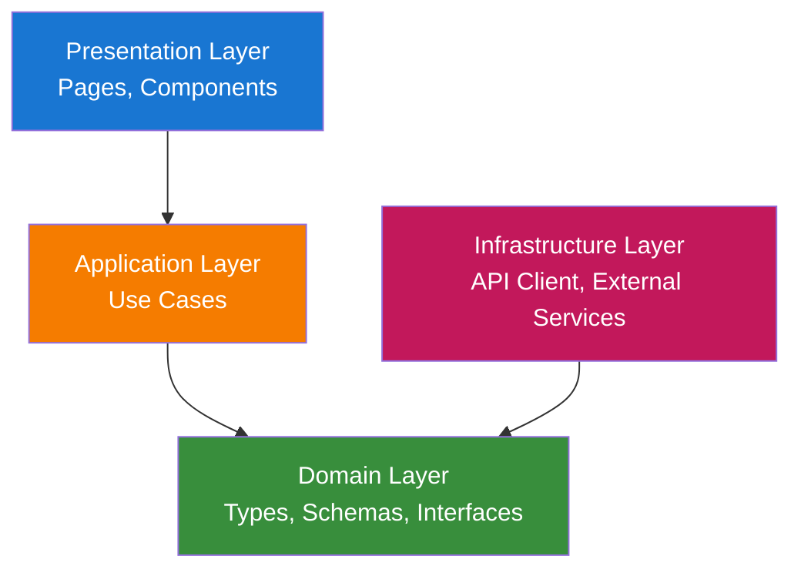
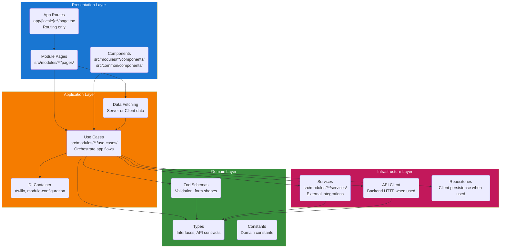
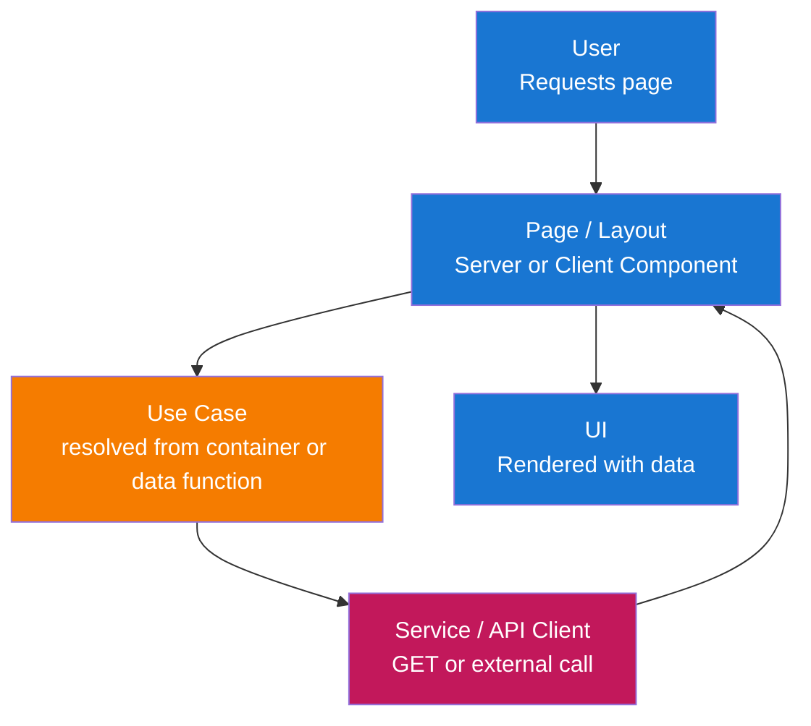
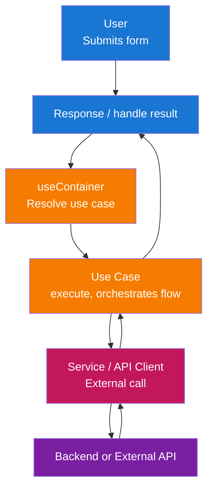

# Architecture

This frontend follows **Clean Architecture** with a **modular** structure. The application is maintainable, testable, and aligned with Next.js and the chosen UI stack.

## Architecture Overview

The solution is organized into layers that enforce separation of concerns and dependency inversion:



**Layer Descriptions:**

- **Presentation Layer**: Entry points for user interaction—Next.js pages, layouts, and React components. This layer renders UI and handles user input, delegating business and data logic to the application layer.

- **Application Layer**: Orchestrates use cases and application logic—data fetching, form submission handling, validation orchestration, and coordination between domain rules and infrastructure. No UI or framework specifics here.

- **Domain Layer**: Core types, Zod schemas, and interfaces used across the app. No external dependencies; defines the shape of data and validation rules (e.g. API contracts, form payloads).

- **Infrastructure Layer**: Technical implementations—API client (HTTP to backend) and external services. Implements interfaces defined by the application or domain layer.

## Layer Structure

The complete layer structure with all components:



## Data Flow

### Read Flow (Server or Client Page)



### Write Flow (Form Submission)



## Layer Responsibilities

### 1. Domain Layer (`src/modules/{module}/domain/`)

Core types and validation with no external dependencies. Shared domain concepts can live in module domain or common interfaces.

**Components:**

- **Types**: Interfaces and type aliases for API responses, form state, and module concepts (e.g. auth types in `src/modules/auth/domain/types.ts`).
- **Zod Schemas**: Validation and parsing for forms in per-module `domain/schemas.ts`.
- **Constants**: Domain-related constants (e.g. route paths, error codes) used within the module.

**Key Principles:**

- No dependencies on other layers or frameworks.
- Pure types and schemas; no I/O, no React, no Next.

### 2. Application Layer (`src/modules/{module}/use-cases/` + DI)

Orchestrates use cases and application logic. Use cases are resolved from the Awilix container; modules register them via `module-configuration.ts`.

**Components:**

- **Use Cases**: Classes (or functions) in `src/modules/{module}/use-cases/` that implement application flows (e.g. `SignInWithEmailUseCase`, `UpdateProfileUseCase`). They extend `BaseUseCase` from `src/common/utils/base-use-case.ts`, use domain types/schemas, and depend on services or API client via the container.
- **Module state**: Module-level state (e.g. Zustand) is exposed via hooks in `src/modules/{module}/hooks/` (e.g. `use-auth-user-store.ts`).
- **Data-fetching**: Server or Client Components load data by resolving and calling use cases from the container.

**Key Principles:**

- Depends only on Domain and Infrastructure (injected via Awilix).
- No UI, no React in use case classes; orchestration only.

### 3. Infrastructure Layer (`src/modules/{module}/services/`)

Implements technical concerns and external integrations. Optional per-module API client or repositories when needed.

**Components:**

- **Services**: External integrations in `src/modules/{module}/services/` (e.g. `FirebaseAuthenticationService` in auth). They implement interfaces defined in `src/modules/{module}/interfaces/`.
- **API Client**: When the app talks to a backend HTTP API, a client can live in `src/common/` or per-module and is registered in the container.
- **Repositories**: Client-side persistence adapters (localStorage, IndexedDB, cookies) when needed.

**Key Principles:**

- Implements interfaces used by use cases (injected via container).
- All external I/O and SDK usage live here.

### 4. Presentation Layer (pages, components)

Handles user interaction and renders UI.

**Components:**

- **App Routes**: `app/[locale]/**/page.tsx` (and route groups like `(marketing)`) serve as the routing layer only. They import and render page components from `src/modules/{module}/pages/`.
- **Module Pages**: `src/modules/{module}/pages/{page}/page.tsx` contain actual page components. Pages can be Server or Client Components; page-specific components live in `pages/{page}/components/`.
- **Components**: Module-shared components in `src/modules/{module}/components/`; shared components in `src/common/components/` (e.g. form, input, label, root-layout, main-layout). Use `"use client"` only where needed (hooks, browser APIs, Zustand).

**Key Principles:**

- Depends on Application (use cases via container) and Domain (types only).
- Framework-specific: Next.js App Router, React. Business logic stays in use cases and services.
- `/app` is for routing only; all application code lives in `/src`.

## Module Structure

The app uses `/src` as the main source folder, keeping `/app` as the routing layer only. Code is organized by **modules** (feature-based) within `/src`, with shared code in `/src/common`.

### Project Structure Overview

```text
app/                               # Routing layer ONLY (Next.js App Router)
├── [locale]/                      # Locale segment (next-intl)
│   ├── layout.tsx                 # Root layout: AppInitializer, SyncAuthState, RootLayout, Toaster
│   ├── error.tsx                  # Error boundary
│   ├── not-found.tsx              # Not-found handler
│   ├── (marketing)/               # Route group: marketing pages
│   │   ├── layout.tsx             # MainLayout with menu, AuthHeaderSlot
│   │   ├── page.tsx               # Landing page (LandingPage from landing-page module)
│   │   ├── docs/
│   │   │   └── [slug]/
│   │   │       └── page.tsx       # Doc page from docs module
│   │   ├── privacy-policy/
│   │   │   └── page.tsx           # Legal module
│   │   └── terms-of-service/
│   │       └── page.tsx           # Legal module
│   ├── app/
│   │   └── page.tsx               # App page from main module
│   └── auth/
│       ├── layout.tsx             # AuthLayout from auth module
│       ├── sign-in/
│       │   └── page.tsx           # SignInPage from auth module
│       ├── sign-up/
│       │   └── page.tsx           # SignUpPage from auth module
│       ├── forgot-password/
│       │   └── page.tsx           # ForgotPasswordPage from auth module
│       └── profile/
│           └── page.tsx           # Profile page from auth module
├── globals.css                    # Global styles
├── layout.tsx                     # Root app layout
└── not-found.tsx                  # Root not-found fallback

src/                               # All application code lives here
├── __tests__/                     # Tests mirror src (application/, common/, modules/) + test-utils/
├── application/                  # App-level setup
│   ├── components/                # App-level components (e.g. AppInitializer)
│   ├── config/                    # App configuration (firebase-config, main-menu)
│   ├── i18n/                      # next-intl request helpers (getRequestConfig)
│   ├── localization/             # next-intl translation JSON (en, vi, zh)
│   └── register-container.ts      # Awilix container registration, module registration
├── common/                        # Shared code across all modules
│   ├── components/                # Shared components (flat)
│   │   ├── button.tsx             # Button, Card, Dialog, Form, Input, Label
│   │   ├── root-layout.tsx        # RootLayout
│   │   ├── main-layout.tsx        # MainLayout, MainHeader
│   │   ├── toaster.tsx            # Toaster (Sonner)
│   │   └── ...                    # app-initializer, back-to-home-button, icons, etc.
│   ├── hooks/                     # Shared hooks (e.g. use-container)
│   ├── interfaces/                # Shared interfaces (e.g. menu-item)
│   ├── pages/                     # Shared page components (error-page, not-found-page)
│   ├── routing/                   # next-intl routing
│   │   ├── routing.ts             # Locales, routing config
│   │   ├── navigation.ts          # Link, useRouter, usePathname
│   │   └── request.ts             # getRequestConfig messages (uses application/localization)
│   └── utils/                     # Utilities (cn, container, base-use-case, menu, read-doc)
│
├── modules/                       # Feature modules
│   ├── auth/                      # Auth module (Firebase, sign-in, sign-up, profile)
│   │   ├── domain/
│   │   │   ├── types.ts           # Auth types
│   │   │   └── schemas.ts         # Auth Zod schemas (login, register, profile)
│   │   ├── use-cases/             # Auth use cases (sign-in, sign-up, sign-out, etc.)
│   │   ├── services/              # Firebase auth service (implements auth interface)
│   │   ├── interfaces/           # BaseAuthenticationService interface
│   │   ├── hooks/                 # use-auth-user-store, use-sync-auth-state
│   │   ├── components/            # AuthLayout, AuthVerification, SyncAuthState, AuthHeaderSlot
│   │   ├── pages/                 # Pages (each in its own folder)
│   │   │   ├── sign-in/
│   │   │   │   ├── page.tsx       # Sign-in page
│   │   │   │   └── components/   # sign-in-form
│   │   │   ├── sign-up/
│   │   │   │   ├── page.tsx       # Sign-up page
│   │   │   │   └── components/   # sign-up-form
│   │   │   ├── forgot-password/
│   │   │   │   ├── page.tsx       # Forgot password page
│   │   │   │   └── components/   # forgot-password-form
│   │   │   └── profile/
│   │   │       ├── page.tsx       # Profile page
│   │   │       └── components/   # profile-form
│   │   ├── utils/                 # map-auth-error, etc.
│   │   └── module-configuration.ts # Awilix: register auth services and use cases
│   │
│   ├── docs/                      # Docs module (markdown docs by slug)
│   │   ├── components/            # MarkdownContent, MermaidDiagram
│   │   ├── pages/doc/page.tsx     # Doc page component
│   │   └── module-configuration.ts
│   ├── landing-page/              # Landing page module
│   │   ├── pages/home/            # Home page + scroll-reveal component
│   │   └── module-configuration.ts
│   ├── legal/                     # Legal pages (privacy, terms)
│   │   ├── pages/privacy-policy/  # and terms-of-service
│   │   └── module-configuration.ts
│   ├── main/                      # Main app page (post-login)
│   │   ├── pages/app/page.tsx
│   │   └── module-configuration.ts
│   │
│   └── {module-name}/             # New modules follow same structure
│       ├── domain/                # types.ts, schemas.ts (when needed)
│       ├── use-cases/             # Use case classes, resolved via container
│       ├── services/              # External services (when needed)
│       ├── interfaces/            # Service/port interfaces (when needed)
│       ├── hooks/                 # Module state hooks (when needed)
│       ├── components/            # Module-shared components
│       ├── pages/                  # pages/{page}/page.tsx + components/
│       ├── utils/                  # Module utilities (when needed)
│       └── module-configuration.ts # registerModule(container)
```

### App Routes (Routing Layer Only)

The `/app` folder contains only Next.js routing files that import from `/src`:

```tsx
// app/[locale]/auth/sign-in/page.tsx
import { SignInPage } from "@/modules/auth/pages/sign-in/page";

export default function Page() {
  return <SignInPage />;
}
```

```tsx
// app/[locale]/layout.tsx
import { AppInitializer } from "@/application/components/app-initializer";
import { RootLayout } from "@/common/components/root-layout";
import { Toaster } from "@/common/components/toaster";
import { SyncAuthState } from "@/modules/auth/components/sync-auth-state";

export default async function LocaleLayout({ children, params }: { ... }) {
  // ... next-intl setup
  return (
    <NextIntlClientProvider locale={locale} messages={messages}>
      <AppInitializer />
      <SyncAuthState />
      <RootLayout>{children}</RootLayout>
      <Toaster />
    </NextIntlClientProvider>
  );
}
```

Route groups (e.g. `(marketing)`) use a shared layout that provides `MainLayout` with menu and auth slot; auth routes use `AuthLayout`. This keeps `/app` minimal and all code in `/src` for better organization and testability.

## Critical Design Patterns

### 1. Clean Architecture / Layered Architecture

**Purpose**: Separation of concerns and dependency inversion (inner layers do not depend on outer layers).

**Implementation:**

- **Domain**: Types, Zod schemas, constants—no framework or I/O.
- **Application**: Use cases (in `use-cases/`); depend only on Domain and Infrastructure interfaces, resolved via Awilix.
- **Infrastructure**: Services (in `services/`) and optional API client; implements interfaces used by use cases.
- **Presentation**: Pages and components; depend on Application (and Domain types).

**Benefits:**

- Testability: Application and domain logic can be tested without UI or real HTTP.
- Maintainability: Changes in one layer are localized.
- Flexibility: Swap API client or auth implementation without changing use cases.

### 2. Modular Feature Structure

**Purpose**: Keep features (auth, docs, landing, legal, main) grouped and boundaries clear.

**Implementation:**

- All code lives in `/src`; `/app` is for routing only.
- Group by feature in `src/modules/{feature}/` with `domain/`, `use-cases/`, `services/`, `interfaces/`, `hooks/`, `components/`, `pages/`, `utils/`, and `module-configuration.ts` for DI registration.
- Shared code (components, hooks, routing, utils, container) lives in `src/common/`. App-level setup (container registration, config, i18n, localization) lives in `src/application/`.

**Benefits:**

- Clear ownership and discoverability.
- Same mental model as backend modules without DDD complexity.
- Better testability with code separated from routing and use cases resolved via container.

### 3. Dependency Injection (Awilix)

**Purpose**: Resolve use cases and services from a container so components stay decoupled and testable.

**Implementation:**

- Container is created in `src/common/utils/container.ts` with `injectionMode: InjectionMode.PROXY` and registered in `src/application/register-container.ts`.
- Each module exposes `registerModule(container)` in `module-configuration.ts`, registering use cases and services (e.g. `asFunction(cradle => new SignInWithEmailUseCase(cradle.authService)).singleton()`).
- Components resolve use cases via `useContainer()` from `src/common/hooks/use-container.ts` and call `execute()`.
- App-level dependencies (e.g. Firebase auth instance) are registered in `register-container.ts`.

**Benefits:**

- Use cases and services are mockable in tests; same API for Server and Client Components.

### 4. API Client / External Services (Infrastructure)

**Purpose**: Centralize backend or external communication and keep use cases independent of HTTP/SDK details.

**Implementation:**

- When the app talks to a backend API, an API client can live in `src/common/` or per-module and be registered in the container. Use domain types for request/response.
- External integrations (e.g. Firebase) live in `src/modules/{module}/services/` and implement interfaces in `src/modules/{module}/interfaces/`. Use cases depend on these interfaces and receive implementations via the container.

**Benefits:**

- Easy to mock in tests and to change backend URL or swap implementations.

### 5. Zod for Validation and Types

**Purpose**: Single source of truth for validation and inferred types.

**Implementation:**

- Zod schemas per-module in `src/modules/{module}/domain/schemas.ts`.
- Use with React Hook Form via `zodResolver(schema)`.
- Export types with `z.infer<typeof schema>`.

**Benefits:**

- Consistent validation on client; type safety from schemas.

### 6. Interfaces for Infrastructure

**Purpose**: Loose coupling between use cases and external services.

**Implementation:**

- Interfaces (e.g. `BaseAuthenticationService`) live in `src/modules/{module}/interfaces/`. Use cases depend on these interfaces; implementations (e.g. `FirebaseAuthenticationService`) live in `services/` and are registered in the container.

**Benefits:**

- Easier unit tests and swapping implementations (e.g. mock auth in tests).

## Technology Stack

- **Framework**: Next.js (App Router), React
- **Language**: TypeScript (strict mode)
- **UI**: shadcn-style components (Radix UI + Tailwind CSS, CVA, clsx, tailwind-merge)
- **State**: Zustand (client-only state, e.g. auth user store)
- **Forms**: React Hook Form with Zod (`@hookform/resolvers/zod`)
- **Validation**: Zod (form validation)
- **i18n**: next-intl (locale-based routing, messages, `getTranslations` / `useTranslations`)
- **DI**: Awilix (container, `register-container.ts`, `module-configuration.ts` per module)
- **Auth**: Firebase (optional; auth module uses Firebase Authentication)
- **Toasts**: Sonner (via `Toaster` in root layout)
- **Testing**: Vitest and React Testing Library (tests in `src/__tests__/`)

## Next.js and Conventions

### App Router (Routing Only)

- **Routes**: `app/[locale]/{segment}/page.tsx` for routing; these files import page components from `src/modules/{module}/pages/`.
- **No code in /app**: All business logic, components, and services live in `/src`. The `/app` folder only handles Next.js routing.
- **Server vs Client**: Pages and components can be Server or Client Components. Default to Server Components; add `"use client"` only for hooks, browser APIs, or Zustand.
- **Client boundary**: Keep `"use client"` as low as possible (leaf components or small wrappers).

### Data Fetching and Mutations

- **Server Components**: Fetch data via use cases (in `src/modules/{module}/use-cases/`, resolved from container when needed); no direct `fetch` in components when it represents a use case.
- **Client Components**: For mutations (forms), resolve use cases via `useContainer()` and call `execute()`. Use cases use services or API client to communicate with the backend or external API. Client Components may also fetch data via use cases when needed.
- **Forms**: Validate with Zod (React Hook Form), then call application services to submit data to the backend.

### File and Folder Conventions

- **All files and folders use kebab-case** (lowercase with hyphens), except Next.js reserved route files like `page.tsx` and `layout.tsx`.
- **All components with props must define a props type** and use it in the component signature.
- **Components without props should not define a props type** or include a props parameter.
- `app/` – routing only (page.tsx, layout.tsx, error.tsx, not-found.tsx); under `app/[locale]/` with next-intl and optional route groups (e.g. `(marketing)`). Imports from `/src`.
- `src/application/` – app-level setup: components (AppInitializer), config (firebase-config, main-menu), i18n (request), localization (translation JSON), register-container.
- `src/common/components/` – shared components (flat: button, card, dialog, form, input, label, root-layout, main-layout, toaster, etc.).
- `src/common/hooks/` – shared hooks (e.g. use-container).
- `src/common/interfaces/` – shared interfaces (e.g. menu-item).
- `src/common/pages/` – shared page components (error-page, not-found-page).
- `src/common/routing/` – next-intl routing (routing.ts), navigation (Link, useRouter, usePathname), request (getRequestConfig messages).
- `src/common/utils/` – utilities (cn, container, base-use-case, menu, read-doc).
- `src/modules/{module}/` – feature modules: domain, use-cases, services, interfaces, hooks, components, pages, utils, module-configuration.ts.
- `src/application/localization/` – next-intl translation JSON files per locale (en, vi, zh).
- `src/__tests__/` – tests mirror src (application/, common/, modules/).

### Forms and Validation

- Use React Hook Form with Zod (`zodResolver(schema)`) and Form components from `src/common/components/`.
- On form submit, resolve the appropriate use case via `useContainer()` and call `execute()` with validated form data. Use cases delegate to services or API client.
- Handle API errors and map them to form state as needed (e.g. via module utils like `map-auth-error`).

### Internationalization (next-intl)

- Locale-based routing: `app/[locale]/...`; middleware for locale detection.
- Server: `getTranslations('namespace')`; client: `useTranslations('namespace')`.
- Use next-intl `Link` and `useRouter` for locale-aware navigation.

