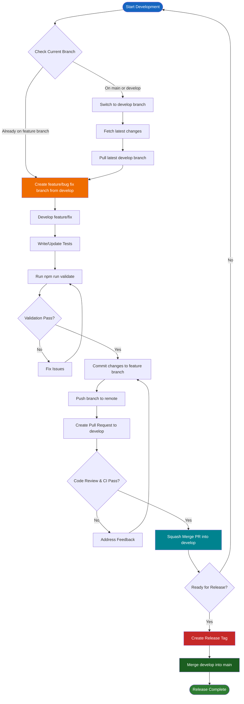

# Development Guide

Hướng dẫn này mô tả từng bước thêm tính năng mới và tạo module mới theo các pattern kiến trúc.

## Mục lục

1. [Git Workflow](#git-workflow)
2. [Adding a New Feature](#adding-a-new-feature)
3. [Creating a New Module](#creating-a-new-module)
4. [Common Patterns](#common-patterns)
5. [Testing Guidelines](#testing-guidelines)

## Git Workflow

Phần này mô tả quy trình Git cho phát triển tính năng và phát hành.

### Development Workflow

Sơ đồ sau minh họa quy trình Git từ phát triển tính năng đến phát hành:

### Workflow Steps

1. **Create Feature/Bug Fix Branch from Develop**
   - Đảm bảo đang ở branch `develop`: `git checkout develop`
   - Lấy thay đổi mới: `git fetch origin`
   - Kéo thay đổi mới: `git pull origin develop`
   - Tạo branch mới: `git checkout -b feature/your-feature-name` hoặc `git checkout -b fix/your-bug-fix-name`
   - Dùng tên branch mô tả rõ, kebab-case (vd. `feature/add-user-authentication`, `fix/pagination-bug`)

2. **Push Code and Create Pull Request**
   - Thực hiện thay đổi code
   - Viết/cập nhật test để giữ 100% coverage
   - Chạy validation: `npm run validate` (phải pass trước khi commit)
   - Commit: `git add . && git commit -m "Descriptive commit message"`
   - Push branch lên remote: `git push -u origin feature/your-feature-name`
   - Tạo Pull Request vào branch `develop`
   - Chờ code review và CI pass

3. **Merge to Develop (Squash Merge)**
   - Sau khi code review được duyệt và mọi CI check pass
   - Merge PR bằng chiến lược **Squash Merge**
   - Tạo một commit trên `develop` gộp toàn bộ thay đổi từ feature branch
   - Có thể xóa feature branch sau khi merge

4. **Create Release Tag and Merge to Main**
   - Khi sẵn sàng phát hành:
     - Tạo release tag trên `develop`: `git tag -a v1.0.0 -m "Release version 1.0.0"`
     - Push tag: `git push origin v1.0.0`
   - Merge `develop` vào `main`:
     - Chuyển sang main: `git checkout main`
     - Kéo mới nhất: `git pull origin main`
     - Merge develop: `git merge develop`
     - Push lên remote: `git push origin main`

### Branch Naming Conventions

- **Feature branches**: `feature/description-of-feature` (vd. `feature/add-user-authentication`)
- **Bug fix branches**: `fix/description-of-bug` (vd. `fix/pagination-validation-error`)
- **Hotfix branches**: `hotfix/description-of-hotfix` (vd. `hotfix/security-patch`)

### Important Notes

- **Không commit trực tiếp lên `main` hoặc `develop`** – luôn dùng feature branch
- **Luôn chạy `npm run validate` trước khi commit** – đảm bảo chất lượng code, format và coverage
- **Dùng squash merge** khi merge PR vào `develop` – giữ lịch sử commit gọn
- **Tạo release tag** trên `develop` trước khi merge vào `main` – đánh dấu điểm phát hành
- **Chỉ merge `develop` vào `main`** khi sẵn sàng phát hành production

## File Naming Conventions

- **Mọi file và thư mục dùng kebab-case** (chữ thường, nối bằng dấu gạch ngang).
- **File route dành riêng Next.js** (`page.tsx`, `layout.tsx`, `loading.tsx`, v.v.) giữ tên bắt buộc.
- **Page module nằm trong thư mục riêng** dưới `src/modules/{module}/pages/{page}/page.tsx`.

## Component Props Types

- **Component có props phải định nghĩa props type** và dùng trong chữ ký component.
- **Component không có props** không định nghĩa props type và không có tham số props.
