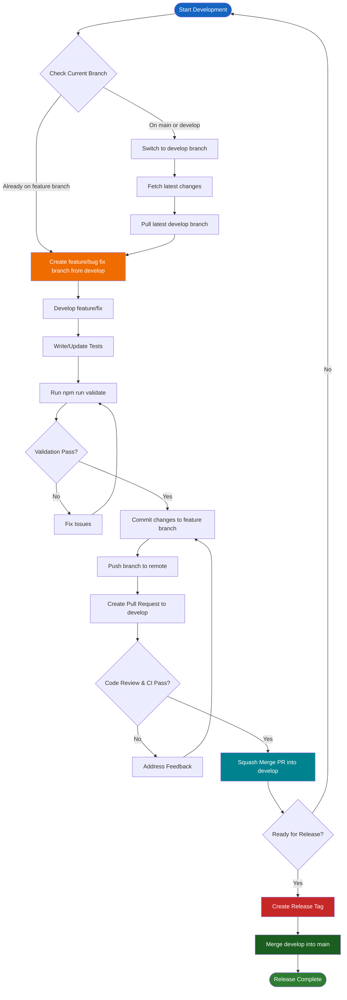

# Development Guide

本指南提供按架构模式添加新功能和创建新 module 的分步说明。

## Table of Contents

1. [Git Workflow](#git-workflow)
2. [Adding a New Feature](#adding-a-new-feature)
3. [Creating a New Module](#creating-a-new-module)
4. [Common Patterns](#common-patterns)
5. [Testing Guidelines](#testing-guidelines)

## Git Workflow

本节描述功能开发与发布的 Git 工作流。

### Development Workflow

以下流程图说明从功能开发到发布的完整 Git 工作流：

### Workflow Steps

1. **Create Feature/Bug Fix Branch from Develop**
   - 确保在 `develop` 分支：`git checkout develop`
   - 获取最新：`git fetch origin`
   - 拉取最新：`git pull origin develop`
   - 创建新分支：`git checkout -b feature/your-feature-name` 或 `git checkout -b fix/your-bug-fix-name`
   - 使用描述性分支名、kebab-case（如 `feature/add-user-authentication`、`fix/pagination-bug`）

2. **Push Code and Create Pull Request**
   - 完成代码修改
   - 编写/更新测试以保持 100% coverage
   - 运行校验：`npm run validate`（提交前必须通过）
   - 提交：`git add . && git commit -m "Descriptive commit message"`
   - 推送到远程：`git push -u origin feature/your-feature-name`
   - 创建以 `develop` 为目标的 Pull Request
   - 等待 code review 与 CI 通过

3. **Merge to Develop (Squash Merge)**
   - Code review 通过且所有 CI 通过后
   - 使用 **Squash Merge** 策略合并 PR
   - 在 `develop` 上产生一个合并了 feature branch 所有改动的 commit
   - 合并后可删除 feature branch

4. **Create Release Tag and Merge to Main**
   - 准备发布时：
     - 在 `develop` 上打 tag：`git tag -a v1.0.0 -m "Release version 1.0.0"`
     - 推送 tag：`git push origin v1.0.0`
   - 将 `develop` 合并进 `main`：
     - 切换到 main：`git checkout main`
     - 拉取最新：`git pull origin main`
     - 合并 develop：`git merge develop`
     - 推送到远程：`git push origin main`

### Branch Naming Conventions

- **Feature branches**：`feature/description-of-feature`（如 `feature/add-user-authentication`）
- **Bug fix branches**：`fix/description-of-bug`（如 `fix/pagination-validation-error`）
- **Hotfix branches**：`hotfix/description-of-hotfix`（如 `hotfix/security-patch`）

### Important Notes

- **不要直接向 `main` 或 `develop` 提交**，始终使用 feature branch
- **提交前务必运行 `npm run validate`**，保证代码质量、格式与 coverage
- **合并到 `develop` 的 PR 使用 squash merge**，保持 commit 历史清晰
- **在将 `develop` 合并到 `main` 前在 `develop` 上打 release tag**，标记发布点
- **仅在准备生产发布时**将 `develop` 合并到 `main`

## File Naming Conventions

- **所有文件与目录使用 kebab-case**（小写连字符）。
- **Next.js 保留路由文件**（`page.tsx`、`layout.tsx`、`loading.tsx` 等）保持规定名称。
- **页面 module 放在独立目录**：`src/modules/{module}/pages/{page}/page.tsx`。

## Component Props Types

- **有 props 的 component 必须定义 props type**，并在 component 签名中使用。
- **无 props 的 component** 不定义 props type，也不包含 props 参数。
