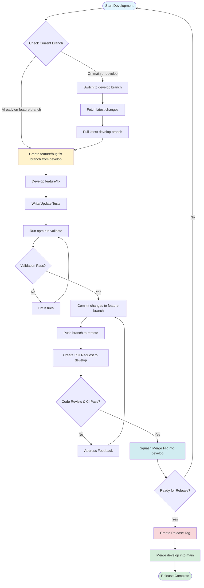

# Development Guide

This guide provides step-by-step instructions for adding new features and creating new modules following the architecture patterns.

## Table of Contents

1. [Git Workflow](#git-workflow)
2. [Adding a New Feature](#adding-a-new-feature)
3. [Creating a New Module](#creating-a-new-module)
4. [Common Patterns](#common-patterns)
5. [Testing Guidelines](#testing-guidelines)

## Git Workflow

This section describes the Git workflow for feature development and releases.

### Development Workflow

The following flowchart illustrates the complete Git workflow from feature development to release:

### Workflow Steps

1. **Create Feature/Bug Fix Branch from Develop**
   - Ensure you're on the `develop` branch: `git checkout develop`
   - Fetch latest changes: `git fetch origin`
   - Pull latest changes: `git pull origin develop`
   - Create a new branch: `git checkout -b feature/your-feature-name` or `git checkout -b fix/your-bug-fix-name`
   - Use descriptive branch names in kebab-case (e.g., `feature/add-user-authentication`, `fix/pagination-bug`)

2. **Push Code and Create Pull Request**
   - Make your code changes
   - Write/update tests to maintain 100% coverage
   - Run validation: `npm run validate` (must pass before committing)
   - Commit changes: `git add . && git commit -m "Descriptive commit message"`
   - Push branch to remote: `git push -u origin feature/your-feature-name`
   - Create a Pull Request targeting the `develop` branch
   - Wait for code review and CI checks to pass

3. **Merge to Develop (Squash Merge)**
   - Once code review is approved and all CI checks pass
   - Merge the PR using **Squash Merge** strategy
   - This creates a single commit on `develop` with all changes from the feature branch
   - The feature branch can be deleted after merging

4. **Create Release Tag and Merge to Main**
   - When ready for a release:
     - Create a release tag on `develop`: `git tag -a v1.0.0 -m "Release version 1.0.0"`
     - Push the tag: `git push origin v1.0.0`
   - Merge `develop` into `main`:
     - Switch to main: `git checkout main`
     - Pull latest: `git pull origin main`
     - Merge develop: `git merge develop`
     - Push to remote: `git push origin main`

### Branch Naming Conventions

- **Feature branches**: `feature/description-of-feature` (e.g., `feature/add-user-authentication`)
- **Bug fix branches**: `fix/description-of-bug` (e.g., `fix/pagination-validation-error`)
- **Hotfix branches**: `hotfix/description-of-hotfix` (e.g., `hotfix/security-patch`)

### Important Notes

- **Never commit directly to `main` or `develop` branches** - always use feature branches
- **Always run `npm run validate` before committing** - this ensures code quality, formatting, and test coverage
- **Use squash merge** when merging PRs to `develop` - this keeps the commit history clean
- **Create release tags** on `develop` before merging to `main` - this marks specific release points
- **Merge `develop` into `main`** only when ready for production release

## File Naming Conventions

- **All files and folders use kebab-case** (lowercase with hyphens).
- **Next.js reserved route files** (`page.tsx`, `layout.tsx`, `loading.tsx`, etc.) keep their required names.
- **Page modules live in their own folder** under `src/modules/{module}/pages/{page}/page.tsx`.

## Component Props Types

- **Components with props must define a props type** and use it in the component signature.
- **Components without props** should not define a props type or include a props parameter.
